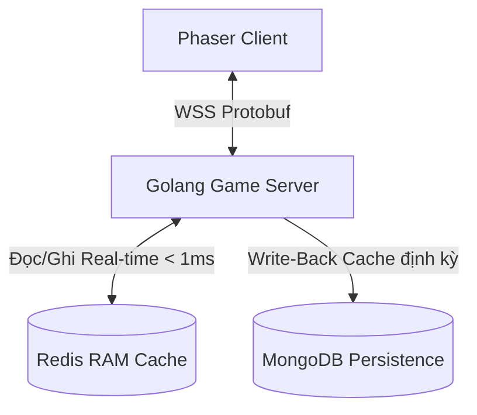

# KẾ HOẠCH TRIỂN KHAI PHASE 3: SHINOBI MERIDIAN RPG (KIẾN TRÚC MẠNG, BẢO MẬT & HẠ TẦNG GOLANG + REDIS + MONGODB)

Tài liệu này đặc tả chi tiết thiết kế kỹ thuật, kiến trúc mạng thời gian thực, cơ chế bảo mật (chống hack/cheat) và hạ tầng phân tầng dữ liệu cho Giai đoạn 3 (Phase 3) của "Shinobi Meridian RPG". Toàn bộ backend được xây dựng trên hệ sinh thái Golang + Redis + MongoDB nhằm tối ưu hóa hiệu năng, băng thông truyền tải và chi phí vận hành VPS.

---

## 1. MỤC TIÊU PHASE 3
1.  **Hạ tầng công nghệ hiệu năng cao (Golang + Redis + MongoDB)**: Đảm bảo khả năng chịu tải hàng nghìn người chơi đồng thời (CCU) chỉ với cấu hình VPS giá rẻ ($5 - $10/tháng).
2.  **Tối ưu hóa băng thông & Độ trễ**: Chuyển đổi định dạng truyền tin nhị phân (Protobuf), hạ tần số Tick Rate xuống 20Hz kết hợp Delta Compression và thuật toán lọc vùng quan tâm AOI.
3.  **Bảo mật tuyệt đối (Server-Authoritative)**: Chống mọi hình thức Hack tốc độ, Hack vị trí, Hack đi xuyên tường (Noclip), Hack Bay, Hack Mana, Hack hồi chiêu (Cooldown), Spam đòn đánh, Replay Attack và Hack sát thương.
4.  **Hòa giải độ trễ mượt mà (Client Prediction & Rollback)**: Tránh cảm giác khựng/lag khi tấn công quái vật bằng cơ chế dự đoán phía máy khách kết hợp Quay ngược thời gian (Lag Compensation) và Đồng bộ lại (Reconciliation) ở máy chủ.

---

## 2. KIẾN TRÚC HẠ TẦNG CƠ SỞ DỮ LIỆU (GOLANG + REDIS + MONGODB)

Sự kết hợp giữa Golang làm lõi xử lý logic, Redis làm cache RAM thời gian thực và MongoDB làm kho lưu trữ vĩnh viễn mang lại hiệu suất tối ưu vượt trội so với các mô hình RDBMS truyền thống (như PostgreSQL).



### A. Golang - Game Server Concurrency & Physics Optimization
*   **Goroutines siêu nhẹ**: Golang sử dụng mô hình lập trình đồng thời dựa trên Goroutine (chỉ tiêu tốn ~2KB RAM cho mỗi luồng xử lý kết nối). Game server có thể quản lý 2,000 - 3,000 kết nối Websocket đồng thời một cách mượt mà trên 1 VPS core đơn mà không bị thắt nút cổ chai luồng (thread bottleneck) như Java hay C#.
*   **Tối ưu hóa Logic Vật lý (Hitbox math)**: Để tiết kiệm CPU, server không chạy các engine vật lý 2D cồng kềnh (như Box2D). Thay vào đó, tất cả va chạm hitbox được quy đổi về các phép tính toán học cơ bản:
    *   *Xác định đòn đánh trúng*: Sử dụng công thức khoảng cách Euclide giữa tâm nhân vật và quái vật:
        $$\Delta x^2 + \Delta y^2 < \text{Range}^2$$
    *   *Xác định va chạm bản đồ*: Sử dụng hệ thống lưới nhị phân (Binary Grid) biểu diễn các ô không thể đi qua (Collidable Tiles). Server chỉ kiểm tra tọa độ nhân vật có nằm trong ô cấm hay không bằng phép tra cứu mảng O(1).

### B. Redis - RAM Cache siêu tốc & Real-time Leaderboard
*   **Hot Session Storage**: Lưu trữ thông tin trạng thái hoạt động tức thời của người chơi (vị trí hiện tại, ID bản đồ, ID ô lưới AOI, trạng thái kết nối). Tốc độ đọc/ghi từ Redis đạt dưới 1ms, giúp Golang Server xác thực thông tin tức thời.
*   **Bảng xếp hạng động (Sorted Sets - ZSET)**: 
    *   Sử dụng cấu trúc dữ liệu `ZSET` của Redis để lưu trữ thứ hạng Level, Sức mạnh và Chakra tích lũy.
    *   Khi người chơi tăng cấp hoặc nhận thêm Chakra, Server gửi lệnh cập nhật lên Redis bằng lệnh `ZADD leaderboard score user_id`. Redis tự động sắp xếp lại vị trí với độ phức tạp $O(\log N)$. Việc truy vấn top 100 người chơi (`ZREVRANGE leaderboard 0 99 WITHSCORES`) diễn ra ngay lập tức mà không cần thực hiện các câu lệnh `ORDER BY` đắt đỏ quét qua toàn bộ cơ sở dữ liệu.

### C. MongoDB - Document Store & Write-Back Cache
*   **Single-Document Save State**: Tránh cấu trúc SQL phức tạp cần liên kết (JOIN) nhiều bảng như `players`, `inventories`, `skills`, `quests`. Toàn bộ dữ liệu người chơi được lưu trữ dưới dạng một tài liệu BSON duy nhất:
    ```json
    {
      "user_id": 12345,
      "stats": { "level": 30, "hp_level": 35, "mana_level": 25, "punch_level": 30, "blast_level": 30, "accumulated_chakra": 340921 },
      "inventory": { "gold": 5000, "gems": 100, "spirit_souls": [{"type": "LoiToc", "slot": "weapon"}] },
      "quests": { "current_quest": "Q008", "progress": {"SQ008_1": 3} }
    }
    ```
    *   *Đăng nhập*: Chỉ cần đúng 1 câu lệnh `db.players.findOne({ "user_id": 12345 })` để tải toàn bộ thông tin người chơi lên RAM.
*   **Schema-less Flexibility**: Dễ dàng cập nhật các chỉ số mới, vật phẩm mới hoặc cơ chế Hồn Linh Thú mà không cần chạy SQL Migration đổi cấu trúc bảng, tránh treo hệ thống khi cập nhật phiên bản mới.
*   **Cơ chế Ghi-Lùi (Write-Back Caching)**: Game server tuyệt đối **không ghi trực tiếp xuống MongoDB mỗi khi quái chết hay người chơi nhặt Chakra** để tránh nghẽn ổ đĩa (I/O Bottleneck).
    *   Mọi thay đổi chỉ số được thực hiện trực tiếp trên bộ nhớ RAM của Server và ghi tạm vào Redis.
    *   Dữ liệu chỉ được ghi xuống MongoDB (Persist) khi: Người chơi chuyển map, người chơi đăng xuất (Logout), hoặc định kỳ tự động lưu (Auto-save) mỗi 5 phút/lần.

### D. So sánh hiệu năng: MongoDB + Redis vs PostgreSQL
*   **PostgreSQL**:
    *   *Ưu điểm*: Đảm bảo tính nhất quán giao dịch (ACID) cực kỳ nghiêm ngặt, chống trùng lặp dữ liệu tốt.
    *   *Nhược điểm*: Khi số lượng người chơi tăng cao, việc JOIN liên tục các bảng để lấy thông tin nhân vật + túi đồ + nhiệm vụ sẽ gây quá tải CPU của DB Server. Việc thay đổi cấu trúc bảng (ALTER TABLE) khi thêm tính năng mới rất phức tạp và có thể gây khóa bảng (Table Lock).
*   **MongoDB + Redis (Lựa chọn tối ưu)**:
    *   *Lý do chọn*: Tách biệt hoàn toàn tầng ghi dữ liệu thời gian thực (Redis RAM) và lưu trữ lâu dài (MongoDB Document). Đọc ghi không block, không JOIN. Tốc độ đọc ghi nhanh hơn gấp 5 - 10 lần PostgreSQL trong kịch bản game online có tần suất cập nhật dữ liệu liên tục. Tính linh hoạt cao giúp đội phát triển cập nhật game liên tục mà không cần dừng server.

---

## 3. TỐI ƯU HÓA ĐỘ TRỄ CHIẾN ĐẤU & HỆ THỐNG KIỂM TRA KÉP (DUAL-CHECK SYSTEM)

### A. Luồng Tối Ưu Độ Trễ Cú Đấm (0ms Attack Delay)
Để người chơi không cảm thấy bị khựng hoặc có cảm giác đấm trượt do độ trễ truyền tín hiệu lên server:

1.  **Thi hành tức thời ở Client (Client-Side Prediction)**: Khi người chơi nhấn nút ĐẤM, Client Phaser lập tức chạy hoạt ảnh đấm, phát âm thanh đòn đánh (SFX) và vẽ vệt sáng đòn đánh ngay lập tức (0ms delay). Đồng thời, gửi gói tin nhị phân lên server: `"Tôi đấm tại tọa độ (x, y) ở Tick T"`.
2.  **Dự đoán va chạm của Client**: Client tự tính toán khoảng cách vật lý đến quái vật trên màn hình. Nếu nằm trong tầm hitbox, Client chạy hiệu ứng tóe lửa (hit particle) và quái vật giật lùi nhẹ.
3.  **Xác thực Server & Bù trừ trễ (Server Lag Compensation - Rollback)**:
    *   Khi gói tin di chuyển từ máy khách lên máy chủ (ví dụ mất 50ms), quái vật trên server có thể đã di chuyển sang vị trí khác.
    *   Server duy trì một **Lịch sử vị trí (History Buffer)** của tất cả thực thể trong vòng 1000ms qua.
    *   Server sử dụng thời gian của gói tin gửi lên để **quay ngược thời gian** thế giới game về đúng thời điểm Tick T của client.
    *   Server kiểm tra: *Tại thời điểm Tick T trong quá khứ, cú đấm có trúng quái vật không?*
    *   Nếu trúng $\rightarrow$ Trừ HP quái vật thật trên server và gửi gói tin xác nhận về client.
    *   Nếu trượt (hoặc hack) $\rightarrow$ Từ chối đòn đánh, không trừ HP quái trên server.
4.  **Hòa giải trạng thái (Server Reconciliation & Visual Smoothing)**:
    *   Để tránh hiện tượng quái vật đột ngột hồi lại máu ảo (health bouncing) gây ức chế cho người chơi khi server từ chối đòn đánh, game áp dụng thiết kế:
        *   Client chạy hoạt ảnh đấm và hiệu ứng trúng đòn (hit effects) tức thời (0ms).
        *   **Tuy nhiên, thanh HP của quái vật và số sát thương nhảy lên (damage popups) chỉ hiển thị khi nhận được gói tin xác nhận từ Server** (độ trễ khoảng 30-80ms, mắt người hoàn toàn thấy mượt mà và tự nhiên).
        *   Nếu server từ chối đòn đánh (do hack hoặc lag quá lớn), client đơn giản là không hiển thị số sát thương và thanh HP quái vật không giảm.

### B. Kịch bản Hack Mana & Hệ thống Kiểm tra Kép (Dual-Check System)
Ngăn chặn hacker can thiệp vào bộ nhớ RAM trình duyệt để sửa đổi chỉ số Mana.

#### 1. Mô tả kịch bản Hack
*   **Trạng thái thực trên Server**: Người chơi còn 5 Mana. Kỹ năng Chưởng lực yêu cầu 10 Mana.
*   **Hành vi Hack**: Hacker sử dụng tool (ví dụ Cheat Engine) sửa đổi bộ nhớ Client thành 100 Mana.
*   **Hành động**: Hacker nhấn nút Chưởng lực. Client thấy 100 Mana $\ge$ 10 Mana nên cho phép thi triển.

#### 2. Quy trình xử lý Kiểm tra Kép (Dual-Check Flow)

```
[Người chơi nhấn nút Chưởng]
       |
       v
[Client-Check]: client_mana >= 10?
       |
       +---> KHÔNG ---> Nháy đỏ nút chiêu, không gửi tin lên server (Chống spam mạng).
       |
       +---> CÓ -------> Trừ client_mana -= 10 (còn 90), chạy hoạt ảnh chưởng,
                         phóng quả cầu lửa đi, gửi gói tin lên Server.
                               |
                               v
                      [Server-Check]: server_mana >= 10?
                               |
                               +---> KHÔNG (Hack/Lệch) ---> Hủy đòn đánh trên Server.
                               |                            Gửi gói tin Từ chối (Reject/Sync) về Client.
                               |                            *Xử lý ở Client*:
                               |                            - Hủy quả cầu lửa đang bay.
                               |                            - Không trừ máu quái vật.
                               |                            - Ép gán client_mana = 5 (Đồng bộ lại trị thực).
                               |
                               +---> CÓ (Hợp lệ) ---------> Trừ server_mana -= 10.
                                                            Tính sát thương thật, gửi xác nhận về.
                                                            Client nhận xác nhận -> Hiện số dame, trừ HP quái.
```

---

## 4. KIẾN TRÚC MẠNG TỐI ƯU & GIAO THỨC TRUYỀN TẢI NHỊ PHÂN

Nhằm tiết kiệm tối đa băng thông truyền tải và tối ưu hóa chi phí thuê server:

### A. Định dạng nhị phân siêu nén (Binary Protobuf)
*   Thay vì truyền tải dạng văn bản JSON nặng nề, game sử dụng **Google Protocol Buffers (Protobuf)** để nén gói tin thành chuỗi byte thô trước khi truyền qua WebSocket.
*   **So sánh kích thước gói tin di chuyển (Move Packet)**:
    *   *JSON format*: `{"action":"move","uid":102,"x":250.5,"y":400.0,"dir":1}` $\rightarrow$ **58 Bytes**.
    *   *Protobuf format (Binary)*: `[0x02, 0x66, 0x43, 0xFA, 0x01, 0x90, 0x01]` $\rightarrow$ **7 Bytes** (Giảm **88%** dung lượng).
*   **Hiệu quả băng thông**: Băng thông trung bình của một người chơi khi di chuyển và chiến đấu liên tục chỉ tốn khoảng **0.5 - 1 KB/s**. Khi đứng yên, băng thông tiêu thụ là **0 KB/s**.

### B. Tần số mạng Tick Rate 20Hz & Delta Compression
*   **Tick Rate 20Hz (50ms/tick)**: Server chỉ cập nhật trạng thái thế giới và gửi thông tin về client 20 lần/giây. Giữa các tick, client tự tính toán nội suy (Interpolation) vị trí của quái vật và người chơi khác để đảm bảo chuyển động mượt mà ở tốc độ 60 FPS.
*   **Delta Compression**: Server chỉ gửi các gói tin cập nhật trạng thái khi thực sự có sự thay đổi (ví dụ: nhân vật bắt đầu chạy, dừng lại, đổi hướng hoặc tung chiêu). Nếu nhân vật đứng yên hoặc quái vật không di chuyển, không có gói tin nào được gửi đi.

### C. Quản lý Vùng Quan Tâm (Area of Interest - AOI)
*   Bản đồ game được chia thành hệ thống lưới ô vuông ảo (Grid Cells) kích thước $400 \times 400$ pixel.
*   Server chỉ truyền phát thông tin di chuyển/tấn công của thực thể A đến người chơi B nếu thực thể A nằm trong các ô lưới lân cận màn hình của người chơi B (tầm nhìn thực tế). Người chơi ở Map khác hoặc góc bản đồ khác sẽ bị lọc bỏ dữ liệu hoàn toàn để tránh nghẽn mạng client.

---

## 5. HỆ THỐNG BẢO MẬT & CHỐNG HACK (SERVER-AUTHORITATIVE)

Để ngăn chặn các hành vi gian lận từ phía client, Game Server đóng vai trò làm trọng tài tối cao kiểm tra và xử lý mọi hành động của người chơi theo các cơ chế sau:

### A. Xác thực Tốc độ & Vị trí (Anti-Speedhack/Teleport)
*   Server liên tục tính toán khoảng cách di chuyển tối đa cho phép dựa trên thuộc tính tốc chạy thực tế của nhân vật trên server.
*   Nếu khoảng cách di chuyển giữa hai gói tin liên tiếp vượt quá giới hạn lý thuyết, server thực hiện giật ngược vị trí (Rubberbanding) hoặc ngắt kết nối trực tiếp (Kick) nếu sai số quá lớn.

### B. Xác thực Thời gian Hồi chiêu (Cooldown Verification)
*   Server lưu trữ mốc thời gian (Timestamp) của lần tung chiêu gần nhất của người chơi.
*   Nếu khoảng cách giữa hai đòn chưởng ngắn hơn thời gian hồi chiêu (cooldown) thực tế của kỹ năng (có tính đến chỉ số giảm hồi chiêu của nhân vật), đòn đánh lập tức bị hủy bỏ trên server.

### C. Giới hạn Tần suất Hành động (Action Rate Limiter - Chống Spam Đòn Đánh)
*   Hacker có thể gửi hàng trăm gói tin ĐẤM thường bằng các công cụ macro/auto-click mà không cần đổi chỉ số sát thương.
*   **Cơ chế**: Server thiết lập một bộ đếm tần suất đòn đánh dựa trên chỉ số Tốc độ đánh (Attack Speed) của người chơi:
    *   Ví dụ: Tốc đánh cho phép tối đa 2 đấm/giây $\rightarrow$ Khoảng cách tối thiểu giữa các đòn đánh $\ge 500\text{ms}$ (cho phép sai số 10% do dao động ping).
    *   Mọi gói tin tấn công đến sớm hơn khoảng thời gian này sẽ bị Server từ chối xử lý và tăng điểm cảnh cáo (Suspicion Score) của tài khoản đó.

### D. Xác thực Trạng thái Di chuyển (Movement State Machine Validation - Chống Noclip / Fly Hack)
*   Hacker có thể sửa client để đi xuyên tường (Wallhack/Noclip) hoặc tự bay lơ lửng vô hạn mà không tốn mana.
*   **Cơ chế**: Server duy trì một Máy trạng thái di chuyển (Movement State Machine) đồng bộ với client: `ĐỨNG_YÊN`, `CHẠY`, `NHẢY`, `BAY`, `RƠI_TỰ_DO`, `DƯỚI_NƯỚC`.
    *   *Check Bay/Rơi tự do*: Nếu tọa độ Y liên tục tăng (bay lên) hoặc đứng yên giữa không trung nhưng trạng thái của người chơi không phải là `BAY` (hoặc mana không bị trừ 3 mana/giây), server sẽ kéo người chơi rơi tự do về mặt đất gần nhất.
    *   *Check xuyên tường*: Server chạy thuật toán kiểm tra va chạm (AABB Check) giữa tọa độ mới của người chơi với Lưới va chạm bản đồ (Binary Grid). Nếu nhân vật đứng đè vào ô cấm, tọa độ sẽ bị reset về vị trí hợp lệ trước đó.

### E. Chống gửi lại gói tin (Sequence ID / Nonce - Chống Replay Attack)
*   Hacker có thể bắt gói tin WebSocket nhặt đồ, hoàn thành nhiệm vụ, hoặc giao dịch, sau đó gửi lại gói tin đó liên tục nhằm nhân bản vật phẩm hoặc nhận tiền vô hạn.
*   **Cơ chế**: 
    *   Mỗi khi Client kết nối, hệ thống sinh ra một bộ đếm tăng dần `Sequence ID` bắt đầu từ `0`.
    *   Mỗi gói tin từ client gửi lên bắt buộc phải đính kèm `Sequence ID` tăng dần theo thứ tự gửi.
    *   Server lưu trữ `Last Processed Sequence ID`. Nếu nhận được gói tin có ID nhỏ hơn hoặc bằng giá trị đã xử lý, Server từ chối ngay lập tức và đánh dấu gói tin giả mạo.

### F. Nhặt Đồ & Giao Dịch Authoritative (Server-Authoritative Transactions & Loot)
*   Tuyệt đối không để Client quyết định nhặt được món đồ gì hoặc mua thành công cái gì.
    *   *Nhặt đồ*: Khi quái chết, server sinh vật phẩm ngẫu nhiên, gán `Spawn_ID` tạm thời trên server và gửi thông báo hiển thị cho client. Khi người chơi đi qua, client gửi gói tin `"Tôi muốn nhặt Spawn_ID tại tọa độ (x,y)"`. Server kiểm tra khoảng cách từ nhân vật đến tọa độ vật phẩm thực tế, nếu $\le 150\text{px}$ mới cộng vật phẩm vào database và gửi lệnh xóa vật phẩm khỏi thế giới game.
    *   *Giao dịch*: Client chỉ gửi yêu cầu mong muốn (ví dụ: "Mua vật phẩm X từ NPC Y"). Server kiểm tra vị trí NPC Y, kiểm tra số vàng trong ví trên Redis/MongoDB, thực hiện trừ tiền và tự động thêm vật phẩm vào túi đồ trực tiếp trên Database rồi đồng bộ lại client.

### G. Mã Hóa Biến Số Trong Bộ Nhớ RAM Client (Runtime Memory Obfuscation)
*   Ngăn chặn hacker sử dụng các công cụ như Cheat Engine để quét tìm địa chỉ RAM của chỉ số HP, Mana, Vàng, Level nhằm thay đổi giá trị hoặc đóng băng chỉ số.
*   **Cơ chế**: Ở phía Phaser Client (Javascript), các chỉ số nhạy cảm được mã hóa liên tục trước khi lưu trữ bằng thuật toán XOR với khóa động sinh ra ngẫu nhiên khi khởi động game:
    *   Công thức lưu trữ:
        $$\text{Value\_Stored} = \text{Value\_Real} \oplus \text{Dynamic\_Key}$$
    *   Mỗi khi render giao diện hoặc tính toán nội bộ, Client dùng hàm getter để giải mã tạm thời:
        $$\text{Value\_Real} = \text{Value\_Stored} \oplus \text{Dynamic\_Key}$$
    *   Điều này làm thay đổi giá trị lưu trữ thực tế trong RAM liên tục, khiến các phần mềm quét bộ nhớ không thể tìm ra giá trị tĩnh.

### H. Mã hóa Payload & Băm mã nguồn (Code Obfuscation & WSS)
*   Bắt buộc sử dụng giao thức bảo mật **WSS (WebSocket Secure)** để mã hóa toàn bộ luồng dữ liệu trên đường truyền mạng, ngăn chặn việc đánh chặn và đọc gói tin nhị phân.
*   Toàn bộ mã nguồn Javascript của Phaser Client được chạy qua công cụ băm mã nguồn nâng cao (`javascript-obfuscator`) để đổi tên biến, mã hóa chuỗi chữ và xáo trộn cấu trúc điều khiển, ngăn chặn dịch ngược code.

---

## 6. HỆ THỐNG NGOẠI LỆ KỸ THUẬT & HƯỚNG XỬ LÝ (EDGE CASES & MITIGATIONS)

Trong quá trình vận hành code thực tế và deploy, hệ thống có thể gặp các ngoại lệ kỹ thuật sau:

### Ngoại lệ 1: Độ trễ mạng quá cao hoặc Ping Spike đột ngột (>300ms)
*   *Vấn đề*: Khi ping người chơi vượt quá 300ms (ví dụ đứt cáp quang), việc quay ngược thời gian (Rollback) quá xa sẽ gây ra hiện tượng giật hình cực kỳ nghiêm trọng (quái vật liên tục biến hình, dịch chuyển tức thời trên màn hình người chơi khác).
*   *Giải pháp*: Giới hạn lịch sử vị trí (History Buffer) tối đa là 1000ms. Nếu ping của người chơi gửi lên vượt quá 300ms, Server sẽ **tắt tính năng bù trễ (Lag Compensation)** đối với người chơi đó, áp dụng cơ chế xác thực vị trí hiện tại của server (nhận sát thương trễ) để bảo vệ trải nghiệm của những người chơi khác.

### Ngoại lệ 2: Mất gói tin (Packet Loss) trên đường truyền
*   *Vấn đề*: Do sử dụng giao thức TCP (WebSocket), gói tin bị mất sẽ kích hoạt cơ chế truyền lại (Retransmission) của hệ điều hành, gây ra hiện tượng nghẽn tạm thời và tăng ping đột ngột.
*   *Giải pháp*: Thiết lập cơ chế Ping/Pong định kỳ mỗi 3 giây để đo RTT (Round Trip Time). Nếu phát hiện tỷ lệ mất gói tin cao, client tự động tăng thời gian đệm nội suy (Interpolation Buffer) từ 100ms lên 200ms để bù đắp khoảng trống dữ liệu bị thiếu trong lúc chờ TCP truyền lại.

### Ngoại lệ 3: Sai số dấu phẩy động (Floating-Point Precision Mismatch)
*   *Vấn đề*: Golang (chạy trên Server x64) và Javascript (chạy trên nhiều loại trình duyệt/thiết bị của Client) có thể tính toán các phép toán dấu phẩy động (float32/float64) ra kết quả lệch nhau vài phần triệu. Sau một thời gian di chuyển, vị trí của nhân vật trên client và server sẽ bị lệch (desync).
*   *Giải pháp*: Sử dụng **Số nguyên dấu phẩy tĩnh (Fixed-Point Arithmetic)**. Toàn bộ tọa độ di chuyển, vận tốc, hitbox đều được nhân với 1,000 trước khi gửi và tính toán (ví dụ: tọa độ 250.5 pixel được lưu và tính toán dưới dạng số nguyên 250500). Server và Client hoàn toàn thực hiện các phép toán trên số nguyên `int32` để đảm bảo tính toán đồng nhất 100% trên mọi thiết bị.

---

## 7. ƯỚC TÍNH CHI PHÍ SERVER & BĂNG THÔNG HẠ TẦNG

Nhờ tối ưu hóa bằng Golang, Redis và Protobuf, chi phí vận hành hạ tầng game được giảm thiểu tối đa:

### A. Tính toán Băng thông (Bandwidth Math)
*   **Với 1 người chơi hoạt động**:
    *   Tần suất gửi tin: 20 gói/giây. Kích thước trung bình: 15 bytes (bao gồm cả overhead TCP).
    *   Băng thông chiều lên (Upload): $20 \times 15 \text{ B} = 300 \text{ B/s} \approx 0.3 \text{ KB/s}$.
    *   Băng thông chiều về (Download - nhờ lọc AOI chỉ gửi 5 đối tượng xung quanh): $20 \times 5 \times 15 \text{ B} = 1500 \text{ B/s} \approx 1.5 \text{ KB/s}$.
    *   Tổng băng thông cho 1 người chơi: $\approx 1.8 \text{ KB/s}$.
*   **Với 1,000 người chơi đồng thời (1,000 CCU)**:
    *   Tổng băng thông yêu cầu: $1,000 \times 1.8 \text{ KB/s} = 1,800 \text{ KB/s} \approx 1,800 \text{ KB/s} \approx 1.8 \text{ MB/s} \approx 14.4 \text{ Mbps}$.
    *   Hầu hết các gói VPS giá rẻ hiện nay đều cung cấp băng thông từ 1 Gbps đến 10 Gbps (hạn mức traffic từ 1TB đến 3TB/tháng). Với 1,000 CCU chạy 24/7, tổng lưu lượng hàng tháng là:
        $$1.8 \text{ MB/s} \times 3600 \text{s} \times 24 \text{h} \times 30 \text{ ngày} \approx 4.6 \text{ TB/tháng}.$$
        Chi phí phụ trội băng thông chỉ tốn khoảng $5 - $10/tháng.

### B. Tính toán CPU & RAM
*   **Bộ nhớ RAM**:
    *   Mỗi kết nối Golang Goroutine + Websocket: ~10KB RAM. Với 1,000 CCU tốn ~10MB RAM.
    *   Redis Cache lưu 1,000 người chơi online: ~50MB RAM.
    *   MongoDB đệm dữ liệu: ~500MB RAM.
    *   Tổng RAM hệ thống thực tế yêu cầu: < 1GB RAM.
*   **Năng lực xử lý CPU**:
    *   Do chỉ xử lý tính toán hitbox bằng toán học cơ bản (khoảng cách Euclide và Binary Grid), 1 CPU Core của VPS có thể dễ dàng xử lý hàng chục nghìn phép tính va chạm mỗi giây.
*   **Khuyến nghị Cấu hình VPS Deploy**:
    *   *Giai đoạn Alpha (Dưới 100 CCU)*: VPS cấu hình 1 Core CPU, 1GB RAM (Chi phí: ~$5/tháng).
    *   *Giai đoạn Beta/Bàn giao (Dưới 1,000 CCU)*: VPS cấu hình 2 Core CPU, 2GB RAM (Chi phí: ~$10 - $15/tháng).
    *   *Giai đoạn Launching (1,000 - 3,000 CCU)*: VPS cấu hình 4 Core CPU, 8GB RAM (Chi phí: ~$40/tháng).

---

## 8. HỆ THỐNG TRANG BỊ VÀ CƯỜNG HÓA THEO GIA TỘC (CLAN EQUIPMENT & ENHANCEMENT SYSTEM)

Để củng cố tiến trình nhân vật từ cấp 1 đến 90 và tạo sự khác biệt sâu sắc trong lối chơi của từng gia tộc, hệ thống trang bị được thiết kế như sau:

### A. Phân cấp Trang bị theo 9 Nhẫn Cấp (9 Equipment Tiers)
*   Trang bị trong game được phân chia thành **9 Tier** tương ứng với 9 Nhẫn Cấp (từ Học Viên đến Lục Đạo). Người chơi bắt buộc phải đạt Nhẫn Cấp tương ứng mới có thể trang bị vật phẩm của Tier đó.
*   Mỗi bộ trang bị đầy đủ của người chơi sẽ bao gồm đúng **6 bộ phận nhẫn giả đặc trưng**: **Băng đeo trán (Headband)**, **Áo (Ninja Shirt)**, **Quần (Ninja Pants)**, **Găng tay (Gloves)**, **Giày (Shoes)**, và **Nhẫn cụ (Ninja Tool)**.

### B. Chế Tạo Đồ Theo Linh Hồn Thần Thú (Beast-Forged Equipment)
*   **Quy luật Số đuôi & Sức mạnh (Tail-to-Power Progression)**: Số lượng đuôi của Thần Thú tỉ lệ thuận với lượng Chakra nguyên tố và sức mạnh thần bí mà nó sở hữu. Nhất Vĩ (1 Đuôi) có sức mạnh cơ bản thấp nhất, tăng tiến dần đến Cửu Vĩ (9 Đuôi) có nguồn Chakra hỗn độn vô hạn và sức mạnh hủy thiên diệt địa vượt trội. Tiến trình sức mạnh này tương ứng trực tiếp với cấp độ và độ khó của các phó bản Gauntlet Raid và Boss Thế Giới từ cấp 1 đến 90.
*   **Danh sách 9 Thượng Cổ Thần Thú & Phân bổ quốc gia**:
    1.  **Nhất Vĩ Thạch Tê (1 Đuôi - Hệ Thổ)**: Trú ẩn dưới cát sâu trong cổ mộ hoang mạc Sa Cát Quốc. Hồn thú phục vụ chế tạo trang bị **Tier 1** (Học Viên, Level 1-10).
    2.  **Nhị Vĩ Hỏa Miêu (2 Đuôi - Hệ Hỏa)**: Trú sâu trong hồ dung nham Hỏa Liên Quốc. Hồn thú phục vụ chế tạo trang bị **Tier 2** (Hạ Nhẫn, Level 11-20).
    3.  **Tam Vĩ Thủy Quy (3 Đuôi - Hệ Thủy)**: Bảo vệ Hồ Băng Vạn Niên Thủy Nguyệt Quốc. Hồn thú phục vụ chế tạo trang bị **Tier 3** (Trung Nhẫn, Level 21-30).
    4.  **Tứ Vĩ Độc Nhện (4 Đuôi - Hệ Độc/Thép)**: Trú trong hang động ẩm ướt U Đầm Quốc. Hồn thú phục vụ chế tạo trang bị **Tier 4** (Thượng Nhẫn, Level 31-40).
    5.  **Ngũ Vĩ Lôi Hầu (5 Đuôi - Hệ Lôi)**: Trú trên các đỉnh núi bão sét Hỏa Liên Quốc. Hồn thú phục vụ chế tạo trang bị **Tier 5** (Ám Bộ, Level 41-50).
    6.  **Lục Vĩ Mộc Độc Linh Ngạc (6 Đuôi - Hệ Mộc/Độc)**: Thống trị đầm lầy sương mù U Đầm Quốc. Hình dạng cá sấu khổng lồ di chuyển bằng 4 chân bọc vảy thép vững chãi, lưng mọc đầy gai gỗ bám rêu phong và 6 chiếc đuôi cá sấu dẹp khỏe khoắn. Hồn thú phục vụ chế tạo trang bị **Tier 6** (Huyền Thoại, Level 51-60).
    7.  **Thất Vĩ Băng Phong (7 Đuôi - Hệ Băng)**: Chim phượng hoàng tuyết làm tổ trên đỉnh núi tuyết cao nhất Thủy Nguyệt Quốc. Hồn thú phục vụ chế tạo trang bị **Tier 7** (Nhẫn Ảnh, Level 61-70).
    8.  **Bát Vĩ Hải Linh (8 Đuôi - Hệ Phong/Thủy)**: Thân rồng có 4 chân và 8 đuôi xúc tu bạch tuộc khổng lồ, ngự trị Vực Sâu Đại Dương Hải Phong Quốc. Hồn thú phục vụ chế tạo trang bị **Tier 8** (Tiên Nhân, Level 71-80).
    9.  **Cửu Vĩ Thiên Hồ (9 Đuôi - Hệ Hỗn Độn)**: Cáo chín đuôi khổng lồ ngự trị tại Thánh Địa Long Mạch Trung Tâm Mộc Vân Quốc. Hồn thú phục vụ chế tạo trang bị **Tier 9** (Nhẫn Thần, Level 81-90).
*   **Cơ chế rèn đồ**: Người chơi thu thập nguyên liệu rèn đặc thù rơi ra từ các Boss hoặc Gauntlet Raid tương ứng với Thần Thú của Tier đó để đúc hoặc nâng cấp phôi đồ tại giao diện Lò rèn.
*   **Thời trang & Hào quang đặc trưng**: Trang bị đúc từ hồn thần thú sẽ mang hoa văn và hiệu ứng hào quang của linh thú đó (Ví dụ: Đồ đúc từ Nhị Vĩ Hỏa Miêu tỏa tia lửa xanh lam nhạt, đồ Tam Vĩ Thủy Quy có vòng gợn nước dưới chân khi chạy, đồ Cửu Vĩ tỏa hào quang vàng kim rực rỡ).


### C. Tiến trình Cường Hóa trang bị bằng Chakra
*   Để gia tăng sức mạnh của trang bị, người chơi có thể tiến hành **Cường hóa trang bị** lên các cấp bậc `+1, +2, +3...` giống như các dòng game MMORPG truyền thống thông qua giao diện lò rèn.
*   **Nguyên liệu cường hóa**: Quá trình cường hóa tiêu tốn **Chakra tích lũy** (EXP cày cuốc) và **Vàng** (hoặc Đá Cường Hóa rớt từ phó bản Co-op).
*   **Chỉ số cộng thêm**: Mỗi cấp cường hóa thành công tăng trực tiếp chỉ số cơ bản của trang bị (ATK cho Găng tay và Nhẫn cụ; HP và DEF phòng thủ cho Áo, Quần, Giày và Băng đeo trán). Cấp cường hóa không bị giới hạn cứng theo level người chơi mà phụ thuộc vào tài nguyên tích lũy và tỷ lệ thành công của lò rèn.

### D. Các Cơ Chế Bổ Trợ Trang Bị (Chỉ số phụ, Tẩy luyện, Phân rã, Luật cường hóa)
Để tạo chiều sâu cày cuốc và đa dạng hóa cách xây dựng nhân vật, hệ thống trang bị tích hợp 4 cơ chế vận hành sau:

1.  **Chỉ số phụ ngẫu nhiên (Random Sub-stats/Affixes)**:
    *   Mỗi trang bị từ Tier 2 trở lên khi rơi ra từ quái hoặc được chế tạo thành công sẽ ngẫu nhiên sở hữu từ **1 đến 3 dòng chỉ số phụ (Sub-stats)** bên cạnh chỉ số chính cố định.
    *   Chỉ số phụ gia tăng các thuộc tính đặc thù bổ trợ lối chơi: Tỷ lệ Né tránh, Tốc độ đánh, Tốc độ di chuyển, Tỷ lệ Chí mạng, Sát thương Chí mạng, Hút máu (Lifesteal), hoặc Tốc độ hồi phục Mana.
2.  **Tẩy luyện thuộc tính phụ (Reforging/Re-rolling)**:
    *   Người chơi có thể thay đổi ngẫu nhiên các dòng chỉ số phụ của trang bị tại giao diện Lò rèn bằng cách tiêu tốn **Chakra tích lũy** và **Vàng**.
    *   **Quy tắc**: Tẩy luyện có **tỷ lệ thành công cố định là 20%**:
        *   *Nếu thành công (20%)*: Các dòng chỉ số phụ của trang bị sẽ được làm mới ngẫu nhiên sang thuộc tính và giá trị trị số mới.
        *   *Nếu thất bại (80%)*: Các dòng chỉ số phụ của trang bị giữ nguyên không thay đổi, người chơi mất toàn bộ lượng Chakra và Vàng đã tiêu tốn cho lượt tẩy đó.
3.  **Phân rã trang bị & Tái chế nguyên liệu (Salvaging & Recycling)**:
    *   Người chơi có thể phân rã các trang bị không sử dụng hoặc trang bị cấp thấp (đồ rác cày map) để dọn dẹp túi đồ và thu hồi nguyên liệu.
    *   *Thu hoạch*: Phân rã hoàn lại một lượng nhỏ **Chakra** và tạo ra **Mảnh Sắt / Mảnh Vải Rèn (Crafting Scraps)** dùng để chế tạo phôi trang bị mới.
4.  **Quy tắc Thất bại khi Cường hóa (Enhancement Failure Rules)**:
    *   Cường hóa từ cấp bậc `+1` đến `+5` có tỷ lệ thành công là 100%.
    *   Cường hóa từ cấp bậc `+6` trở lên có tỷ lệ thất bại tương ứng theo cấp cộng tăng dần.
    *   **Khi Cường hóa Thất bại (Đập xịt)**:
        *   **Cấp cường hóa hiện tại của trang bị được giữ nguyên** (không bị tụt cấp cộng, không bị giảm chỉ số, không bị vỡ hay phá hủy trang bị).
        *   Tuy nhiên, người chơi sẽ **mất toàn bộ các phụ kiện cường hóa đập kèm** (như bùa bảo vệ, đá tăng tỷ lệ) cùng lượng Vàng và Chakra tiêu tốn cho lượt đập đó.

### E. Bảng Tên Gọi Hệ Thống Trang Bị 6 Món Theo 9 Cấp Bậc (9 Tiers Equipment Names)

Dưới đây là danh sách tên gọi chi tiết cho từng món trang bị của 3 Gia tộc qua 9 cấp bậc (Tier 1 đến Tier 9):

#### 1. Mộc Linh Tộc (Tộc Hệ Mộc / Đất - Chỉ số ưu tiên: HP tối đa, Thủ vật lý, Giảm sát thương)

| Cấp Bậc (Tier) | Nhẫn Cấp Tương Ứng | Băng Đeo Trán (Headband) | Áo (Shirt) | Quần (Pants) | Găng Tay (Gloves) | Giày (Shoes) | Nhẫn Cụ (Ninja Tool) |
| :--- | :--- | :--- | :--- | :--- | :--- | :--- | :--- |
| **Tier 1** | Học Viên (Lvl 1-10) | Băng Trán Gỗ Mộc | Áo Thiết Mộc | Quần Thiết Mộc | Băng Tay Vải Thô | Giày Vải Thô | Phi Tiêu Gỗ |
| **Tier 2** | Hạ Nhẫn (Lvl 11-20) | Băng Trán Lục Diệp | Giáp Lá Thanh Diệp | Quần Lá Thanh Diệp | Băng Tay Da Rừng | Giày Da Rừng | Trọng Thiết Trảo |
| **Tier 3** | Trung Nhẫn (Lvl 21-30) | Băng Trán Hộ Vệ | Giáp Gỗ Bạch Đàn | Quần Gỗ Bạch Đàn | Bao Tay Bạch Đàn | Bốt Gỗ Bạch Đàn | Trọng Thiết Đao |
| **Tier 4** | Thượng Nhẫn (Lvl 31-40) | Băng Trán Địa Long | Giáp Thạch Thổ | Quần Thạch Thổ | Hộ Thủ Địa Long | Bốt Thạch Thổ | Địa Long Trọng Phủ |
| **Tier 5** | Ám Bộ (Lvl 41-50) | Mặt Nạ Ám Bộ Mộc | Giáp Kim Cương Gỗ | Quần Kim Cương Gỗ | Hộ Thủ Kim Thạch | Giày Điêm Thạch | Cự Thiết Kiếm |
| **Tier 6** | Huyền Thoại (Lvl 51-60) | Băng Trán Cổ Thụ | Giáp Vạn Niên Mộc | Quần Vạn Niên Mộc | Hộ Thủ Cổ Thụ | Giày Cổ Thụ | Cổ Thụ Thiên Trượng |
| **Tier 7** | Nhẫn Ảnh (Lvl 61-70) | Băng Trán Sơn Thần | Giáp Sơn Thạch Quy | Quần Sơn Thạch Quy | Hộ Thủ Sơn Thần | Bốt Sơn Thạch | Sơn Thần Cự Phủ |
| **Tier 8** | Tiên Nhân (Lvl 71-80) | Băng Trán Tiên Nhân | Giáp Hộ Thể Tiên Nhân | Quần Hộ Thể Tiên Nhân | Hộ Thủ Tiên Lực | Giày Tiên Thể | Thần Mộc Thượng Kiếm |
| **Tier 9** | Nhẫn Thần (Lvl 81-90) | Băng Trán Hoàng Thiên | Pháp Giáp Hoàng Thổ Thiên Giới | Pháp Quần Hoàng Thổ Thiên Giới | Hộ Thủ Thiên Giới Hoàng Thiên | Bốt Hoàng Thổ Thiên Giới | Thiên Giới Thần Thương |

##### *Prompts Sinh Ảnh AI (Gemini/Imagen) - Thiết kế Spine2D (T-Pose & Inpaint)*
*   **Quy trình dựng hình Spine2D**:
    1.  **Gen ảnh gốc (Base T-Pose)**: Sử dụng Base Prompt để tạo 1 ảnh nhân vật T-pose/A-pose toàn thân, đồng nhất ánh sáng, tỷ lệ và phong cách nghệ thuật.
    2.  **Inpaint tinh chỉnh (Inpaint Detail)**: Sử dụng Inpaint Prompt Guide để vẽ đè và tinh chỉnh chi tiết trực tiếp từng vùng (Áo, Quần, Găng tay, Giày, Băng trán, Nhẫn cụ) trên CÙNG 1 ảnh gốc, giữ nguyên tư thế và tỷ lệ cơ thể.
    3.  **Tách Layer & Generative Fill**: Tách thủ công các layer trong Photoshop và dùng Generative Fill để vẽ bù các phần bị che khuất trước khi xuất PNG đưa vào Spine.
*   **Base Prompt Template**: `Full body character concept sheet, front view, symmetrical T-pose, anime game style, strictly flat 2D vector art, unlit, no gradients, flat local colors only, no directional light, symmetrical ambient lighting, clean black outlines, solid black background. [Character Outfit & Gear Details]. Hands are empty, open palms facing forward with fingers spread. Low collar showing clear neck skin. Sleeves show a clear gap of skin at the wrists. Belt is aligned flat on the waist. All weapons and accessories are generated as separate floating objects next to the character. --no watermark, text`
*   **Chi tiết Prompt từng Tier (Base T-Pose & Inpaint Guides)**:
    *   **Tier 1 (Học Viên)**:
        - *Base T-Pose*: `Full body character concept sheet, front view, symmetrical T-pose, anime game style, strictly flat 2D vector art, unlit, no gradients, flat local colors only, no directional light, symmetrical ambient lighting, clean black outlines, solid black background. A young Mộc Linh Clan apprentice ninja. Wearing a green shinobi shozoku (ninja garment) with a low collar showing neck skin, matching pants, a moss-green cowl mask covering the nose and mouth, rough wood-fiber wrist wraps showing wrist skin, and rope sandals. Green cloth headband with a simple wooden protector plate. Hands are empty, open palms facing forward. A wooden shuriken is generated as a separate floating object next to the character. Color palette: flat moss green, flat earth brown, flat oak wood brown.`
        - *Inpaint Guides*:
            *   *Băng trán*: `Moss green cloth headband, simple carved oak plate protector, high detail`
            *   *Áo*: `Green shinobi shozoku shirt, low collar showing neck skin`
            *   *Quần*: `Green shinobi shozoku pants, flat waistline`
            *   *Găng tay*: `Rough wood-fiber wrist wraps, showing wrist skin separation`
            *   *Giày*: `Flat ninja sandals made of dark green and brown hemp ropes`
            *   *Nhẫn cụ*: `Carved wooden shuriken weapon, generated next to the hand, not held`
    *   **Tier 2 (Hạ Nhẫn)**:
        - *Base T-Pose*: `Full body character concept sheet, front view, symmetrical T-pose, anime game style, strictly flat 2D vector art, unlit, no gradients, flat local colors only, no directional light, symmetrical ambient lighting, clean black outlines, solid black background. A Mộc Linh Clan genin ninja. Wearing light leaf-woven stealth armor (low collar showing neck skin), a dark green fabric mask covering the nose and mouth, green leaf-patterned leather pants, forest green wrist guards showing wrist skin, forest green leather boots. Green cloth headband with a leaf-shaped copper plate. Hands are empty, open palms facing forward. An iron claw weapon is generated as a separate floating object next to the character. Color palette: flat forest green, flat leather brown, flat copper.`
        - *Inpaint Guides*:
            *   *Băng trán*: `Forest green cloth headband, green leaf-shaped copper plate, high detail`
            *   *Áo*: `Light ninja shirt made of woven green leaves, low collar showing neck skin`
            *   *Quần*: `Light ninja pants made of green leaves, flat waistline`
            *   *Găng tay*: `Forest green leather wrist guards, showing wrist skin separation`
            *   *Giày*: `Forest green leather ninja boots, flexible sole`
            *   *Nhẫn cụ*: `Iron claw weapon (tekko-kagi) with forest green steel blades, generated next to the hand, not held`
    *   **Tier 3 (Trung Nhẫn)**:
        - *Base T-Pose*: `Full body character concept sheet, front view, symmetrical T-pose, anime game style, strictly flat 2D vector art, unlit, no gradients, flat local colors only, no directional light, symmetrical ambient lighting, clean black outlines, solid black background. A Mộc Linh Clan chunin ninja. Wearing a birch-wood plated ninja armor tunic (low collar showing neck skin), an olive-green cowl covering the neck and lower face, matching pants with birch-wood knee guards, birch-wood plated fingerless gloves showing wrist skin, high boots made of white-birch bark. Headband with white-birch wood protector plate. Hands are empty, open palms facing forward. A heavy iron cleaver sword is generated as a separate floating object next to the character. Color palette: flat olive green, flat white-birch wood, flat steel gray.`
        - *Inpaint Guides*:
            *   *Băng trán*: `Olive green headband, polished white-birch wood protector plate, high detail`
            *   *Áo*: `Birch-wood plated ninja armor tunic, V-neck showing neck skin, olive green underlay`
            *   *Quần*: `Ninja pants with birch-wood knee guards, flat waistline`
            *   *Găng tay*: `Birch-wood plated fingerless gloves, showing wrist skin separation`
            *   *Giày*: `High ninja boots made of white-birch bark and green leather`
            *   *Nhẫn cụ*: `Heavy iron cleaver sword, birch-wood handle, generated next to the hand, not held`
    *   **Tier 4 (Thượng Nhẫn)**:
        - *Base T-Pose*: `Full body character concept sheet, front view, symmetrical T-pose, anime game style, strictly flat 2D vector art, unlit, no gradients, flat local colors only, no directional light, symmetrical ambient lighting, clean black outlines, solid black background. A Mộc Linh Clan jonin ninja. Wearing heavy jade-plated shinobi armor vest, a jade-green cowl covering the neck and lower face (low collar showing neck skin), matching pants with dragon scale patterns, heavy stone gauntlets showing wrist skin, heavy stone boots. Headband with a dark stone earth dragon plate. Hands are empty, open palms facing forward. A massive battleaxe is generated as a separate floating object next to the character. Color palette: flat jade green, flat stone gray, flat dark slate.`
        - *Inpaint Guides*:
            *   *Băng trán*: `Deep jade green headband, dark stone plate carved with earth dragon motif`
            *   *Áo*: `Heavy stone-plated ninja vest, low collar showing neck skin, jade green scale patterns`
            *   *Quần*: `Heavy stone-plated ninja pants, flat waistline, jade green scale patterns`
            *   *Găng tay*: `Heavy stone gauntlets, showing wrist skin separation`
            *   *Giày*: `Heavy stone-plated ninja boots, jade green accents, sturdy sole`
            *   *Nhẫn cụ*: `Heavy battleaxe made of dark stone and jade, generated next to the hand, not held`
    *   **Tier 5 (Ám Bộ)**:
        - *Base T-Pose*: `Full body character concept sheet, front view, symmetrical T-pose, anime game style, strictly flat 2D vector art, unlit, no gradients, flat local colors only, no directional light, symmetrical ambient lighting, clean black outlines, solid black background. An elite shadow spec-ops wood ninja wearing a stylized owl porcelain mask. Wearing a dark green armored tactical utility vest over a breathable black mesh fabric undergarment (V-neck showing neck skin), matching pants with iron-wood shin protectors, iron-wood gauntlets showing wrist skin, scale mail boots. Hands are empty, open palms facing forward. A long ninja sword is generated as a separate floating object next to the character. Color palette: flat dark green, flat charcoal gray, flat wood brown.`
        - *Inpaint Guides*:
            *   *Băng trán (Mặt nạ)*: `Stylized owl porcelain mask, green and black highlights`
            *   *Áo*: `Dark green tactical utility vest, V-neck showing neck skin, black mesh fabric undergarment`
            *   *Quần*: `Dark green ninja pants with iron-wood shin protectors`
            *   *Găng tay*: `Dark green iron-wood gauntlets, showing wrist skin separation`
            *   *Giày*: `Silent dark green boots made of scale mail`
            *   *Nhẫn cụ*: `Long ninja sword made of dark green steel with diamond-wood hilt, generated next to the hand, not held`
    *   **Tier 6 (Huyền Thoại)**:
        - *Base T-Pose*: `Full body character concept sheet, front view, symmetrical T-pose, anime game style, strictly flat 2D vector art, unlit, no gradients, flat local colors only, no directional light, symmetrical ambient lighting, clean black outlines, solid black background. A legendary wood ninja warrior. Wearing a shirt and pants made of woven ancient elderwood plates (low collar showing neck skin) with glowing green veins, elderwood arm guards and boots, and a crown-like headband of glowing elderwood with an emerald gem. Hands are empty, open palms facing forward. A magical elderwood staff is generated as a separate floating object next to the character. Color palette: flat emerald green, flat elderwood brown, flat glowing lime green.`
        - *Inpaint Guides*:
            *   *Băng trán*: `Ancient crown-like headband made of glowing green elderwood, emerald gem`
            *   *Áo*: `Legendary ninja shirt made of woven ancient elderwood plates, V-neck showing neck skin`
            *   *Quần*: `Legendary ninja pants made of ancient elderwood plates`
            *   *Găng tay*: `Elderwood arm guards, showing wrist skin separation`
            *   *Giày*: `Elderwood plated boots with glowing green magical roots wrapping the ankles`
            *   *Nhẫn cụ*: `Magical elderwood staff, glowing green crystal floating at the tip, generated next to the hand, not held`
    *   **Tier 7 (Nhẫn Ảnh)**:
        - *Base T-Pose*: `Full body character concept sheet, front view, symmetrical T-pose, anime game style, strictly flat 2D vector art, unlit, no gradients, flat local colors only, no directional light, symmetrical ambient lighting, clean black outlines, solid black background. A supreme wood ninja grandmaster. Wearing a ceremonial grandmaster armor vest made of stone-shell turtle plates (V-neck showing neck skin) over a pine green silk robe, matching pants with gold thread embroidery, grandmaster gauntlets showing wrist skin, pine green steel boots. Headband with a grandmaster forehead protector plate. Hands are empty, open palms facing forward. A massive twin-headed pine-green battleaxe is generated as a separate floating object next to the character. Color palette: flat pine green, flat gold, flat jade green.`
        - *Inpaint Guides*:
            *   *Băng trán*: `Deep pine green headband, grandmaster forehead protector plate, mountain god runes`
            *   *Áo*: `Ceremonial grandmaster armor vest made of stone-shell turtle plates, V-neck showing neck skin, pine green silk`
            *   *Quần*: `Majestic Kage pants, pine green silk with gold thread embroidery`
            *   *Găng tay*: `Grandmaster gauntlets, pine green steel plates, showing wrist skin separation`
            *   *Giày*: `Heavy stone Kage boots, golden linings, pine green straps`
            *   *Nhẫn cụ*: `Massive twin-headed battleaxe, pine green steel blade, generated next to the hand, not held`
    *   **Tier 8 (Tiên Nhân)**:
        - *Base T-Pose*: `Full body character concept sheet, front view, symmetrical T-pose, anime game style, strictly flat 2D vector art, unlit, no gradients, flat local colors only, no directional light, symmetrical ambient lighting, clean black outlines, solid black background. An ascended woodland sage ninja. Wearing lightweight sage robes and pants (V-neck showing neck skin) made of green silk with golden celestial embroidery, lime green energy gloves, grass-woven sage sandals, and a headband with a grandmaster forehead protector. Hands are empty, open palms facing forward. A divine wood sword is generated as a separate floating object next to the character. Color palette: flat lime green, flat gold, flat emerald green.`
        - *Inpaint Guides*:
            *   *Băng trán*: `Sage headband with a grandmaster forehead protector, lime green glowing aura`
            *   *Áo*: `Lightweight sage robe shirt, green silk, V-neck showing neck skin`
            *   *Quần*: `Sage pants, green silk, golden wind patterns`
            *   *Găng tay*: `Fingerless sage gloves, showing wrist skin separation`
            *   *Giày*: `Sage sandals, glowing green grass-woven material`
            *   *Nhẫn cụ*: `Divine wood sword, generated next to the hand, not held`
    *   **Tier 9 (Nhẫn Thần)**:
        - *Base T-Pose*: `Full body character concept sheet, front view, symmetrical T-pose, anime game style, strictly flat 2D vector art, unlit, no gradients, flat local colors only, no directional light, symmetrical ambient lighting, clean black outlines, solid black background. A divine transcendent wood deity ninja. Wearing transcendent deity plate armor shirt and pants (low collar showing neck skin) with glowing yellow-gold energy plates, emerald green flowing chakra cape, yellow-gold and green scale gauntlets showing wrist skin, matching boots. Headband with a transcendent deity forehead protector plate. Hands are empty, open palms facing forward. A ringed deity scepter is generated as a separate floating object next to the character. Color palette: flat yellow-gold, flat emerald green, flat light green.`
        - *Inpaint Guides*:
            *   *Băng trán*: `Deity forehead protector plate, bright emerald green fabric`
            *   *Áo*: `Transcendent deity armor shirt, V-neck showing neck skin, yellow-gold plates`
            *   *Quần*: `Six-Paths divine pants, emerald green fabric, yellow-gold chakra patterns`
            *   *Găng tay*: `Deity gauntlets, yellow-gold and emerald green scales, showing wrist skin separation`
            *   *Giày*: `Six-Paths boots, bright green chakra soles, yellow-gold metallic details`
            *   *Nhẫn cụ*: `Ringed deity scepter made of dark wood, generated next to the hand, not held`

#### 2. Huyết Nhãn Tộc (Tộc Hệ Hỏa / Ảo thuật - Chỉ số ưu tiên: Sức đánh ATK, Tỷ lệ Chí mạng, Dame Chí mạng)

| Cấp Bậc (Tier) | Nhẫn Cấp Tương Ứng | Băng Đeo Trán (Headband) | Áo (Shirt) | Quần (Pants) | Găng Tay (Gloves) | Giày (Shoes) | Nhẫn Cụ (Ninja Tool) |
| :--- | :--- | :--- | :--- | :--- | :--- | :--- | :--- |
| **Tier 1** | Học Viên (Lvl 1-10) | Băng Trán Hỏa Tinh | Áo Vải Đỏ | Quần Vải Đỏ | Băng Tay Vải Đỏ | Giày Vải Đỏ | Hỏa Tinh Phi Tiêu |
| **Tier 2** | Hạ Nhẫn (Lvl 11-20) | Băng Trán Hỏa Liên | Áo Hỏa Liên | Quần Hỏa Liên | Hộ Thủ Hỏa Liên | Giày Hỏa Liên | Hỏa Liên Nhẫn Đao |
| **Tier 3** | Trung Nhẫn (Lvl 21-30) | Băng Trán Hồng Diệp | Áo Hắc Y Hỏa Ảnh | Quần Hắc Y Hỏa Ảnh | Hộ Thủ Hồng Diệp | Giày Hồng Diệp | Hồng Diệp Trảm Đao |
| **Tier 4** | Thượng Nhẫn (Lvl 31-40) | Băng Trán Xích Long | Giáp Xích Lân | Quần Xích Lân | Hộ Thủ Xích Lân | Bốt Xích Lân | Xích Long Quạt Xếp |
| **Tier 5** | Ám Bộ (Lvl 41-50) | Mặt Nạ Ám Bộ Hỏa | Áo Choàng Dạ Hành | Quần Dạ Hành | Hộ Thủ Ám Hỏa | Bốt Dạ Hành | Ám Hỏa Song Thao |
| **Tier 6** | Huyền Thoại (Lvl 51-60) | Băng Trán Huyết Nguyệt | Ma Giáp Huyết Nguyệt | Ma Quần Huyết Nguyệt | Hộ Thủ Huyết Nguyệt | Bốt Huyết Nguyệt | Huyết Nguyệt Ma Kiếm |
| **Tier 7** | Nhẫn Ảnh (Lvl 61-70) | Băng Trán Viêm Đế | Long Giáp Viêm Long | Long Quần Viêm Long | Hộ Thủ Viêm Long | Bốt Viêm Long | Viêm Đế Cự Kiếm |
| **Tier 8** | Tiên Nhân (Lvl 71-80) | Băng Trán Tiên Hỏa | Pháp Y Tiên Nhân Hỏa | Pháp Quần Tiên Nhân Hỏa | Hộ Thủ Tiên Hỏa | Giày Tiên Hỏa | Tiên Hỏa Pháp Trượng |
| **Tier 9** | Nhẫn Thần (Lvl 81-90) | Băng Trán Lục Đạo Ma Nhãn | Lân Giáp Lục Đạo Huyết Nguyệt | Lân Quần Lục Đạo Huyết Nguyệt | Hộ Thủ Lục Đạo Hỏa Thần | Bốt Lục Đạo Huyết Nguyệt | Lục Đạo Hỏa Thần Quạt Xếp |

##### *Prompts Sinh Ảnh AI (Gemini/Imagen) - Thiết kế Spine2D (T-Pose & Inpaint)*
*   **Quy trình dựng hình Spine2D**:
    1.  **Gen ảnh gốc (Base T-Pose)**: Sử dụng Base Prompt để tạo 1 ảnh nhân vật T-pose/A-pose toàn thân, đồng nhất ánh sáng, tỷ lệ và phong cách nghệ thuật.
    2.  **Inpaint tinh chỉnh (Inpaint Detail)**: Sử dụng Inpaint Prompt Guide để vẽ đè và tinh chỉnh chi tiết trực tiếp từng vùng (Áo, Quần, Găng tay, Giày, Băng trán, Nhẫn cụ) trên CÙNG 1 ảnh gốc, giữ nguyên tư thế và tỷ lệ cơ thể.
    3.  **Tách Layer & Generative Fill**: Tách thủ công các layer trong Photoshop và dùng Generative Fill để vẽ bù các phần bị che khuất trước khi xuất PNG đưa vào Spine.
*   **Base Prompt Template**: `Full body character concept sheet, front view, symmetrical T-pose, anime game style, strictly flat 2D vector art, unlit, no gradients, flat local colors only, no directional light, symmetrical ambient lighting, clean black outlines, solid black background. [Character Outfit & Gear Details]. Hands are empty, open palms facing forward with fingers spread. Low collar showing clear neck skin. Sleeves show a clear gap of skin at the wrists. Belt is aligned flat on the waist. All weapons and accessories are generated as separate floating objects next to the character. --no watermark, text`
*   **Chi tiết Prompt từng Tier (Base T-Pose & Inpaint Guides)**:
    *   **Tier 1 (Học Viên)**:
        - *Base T-Pose*: `Full body character concept sheet, front view, symmetrical T-pose, anime game style, strictly flat 2D vector art, unlit, no gradients, flat local colors only, no directional light, symmetrical ambient lighting, clean black outlines, solid black background. A young Huyết Nhãn Clan ninja apprentice. Wearing a simple V-neck black linen shirt, black pants with red linings, simple red hand wraps showing wrist skin, red slippers. Simple red headband on head. Hands are empty, open palms facing forward. A fire-red steel shuriken is generated as a separate floating object next to the character. Color palette: flat black, flat crimson red, flat charcoal gray.`
        - *Inpaint Guides*:
            *   *Băng trán*: `Simple red cloth headband, high detail`
            *   *Áo*: `Simple red ninja shirt, V-neck showing neck skin`
            *   *Quần*: `Simple red ninja pants, black fabric linings, flat waistline`
            *   *Găng tay*: `Hand wraps made of crimson red cloth, showing wrist skin separation`
            *   *Giày*: `Simple red fabric ninja slippers`
            *   *Nhẫn cụ*: `Fire-red shuriken, simple red steel star, generated next to the hand, not held`
    *   **Tier 2 (Hạ Nhẫn)**:
        - *Base T-Pose*: `Full body character concept sheet, front view, symmetrical T-pose, anime game style, strictly flat 2D vector art, unlit, no gradients, flat local colors only, no directional light, symmetrical ambient lighting, clean black outlines, solid black background. A Huyết Nhãn Clan ninja. Wearing crimson ninja tunic (V-neck showing neck skin) with red lotus patterns, crimson pants, black leather wrist guards showing wrist skin, crimson boots. Headband with red lotus engraved plate. Hands are empty, open palms facing forward. A kunai-style sword with a red lotus pommel is generated as a separate floating object next to the character. Color palette: flat crimson red, flat black, flat copper.`
        - *Inpaint Guides*:
            *   *Băng trán*: `Crimson cloth headband, red lotus engraved plate, high detail`
            *   *Áo*: `Crimson ninja tunic, V-neck showing neck skin`
            *   *Quần*: `Crimson ninja pants, red lotus patterns on the legs`
            *   *Găng tay*: `Wrist guards, showing wrist skin separation, red lotus flame patterns on black leather`
            *   *Giày*: `Crimson leather ninja boots with red lotus petal patterns`
            *   *Nhẫn cụ*: `Straight ninja sword (kunai-style) with a red lotus pommel, crimson steel blade, generated next to the hand, not held`
    *   **Tier 3 (Trung Nhẫn)**:
        - *Base T-Pose*: `Full body character concept sheet, front view, symmetrical T-pose, anime game style, strictly flat 2D vector art, unlit, no gradients, flat local colors only, no directional light, symmetrical ambient lighting, clean black outlines, solid black background. A Huyết Nhãn Clan ninja. Wearing a charcoal black stealth ninja shirt (V-neck showing neck skin), matching pants with crimson leaf crests, black plated gloves showing wrist skin, charcoal black boots. Headband with charcoal steel plate. Hands are empty, open palms facing forward. A large executioner sword (zanbato) is generated as a separate floating object next to the character. Color palette: flat charcoal black, flat crimson red, flat steel gray.`
        - *Inpaint Guides*:
            *   *Băng trán*: `Dark charcoal steel protector, crimson leaf pattern headband`
            *   *Áo*: `Charcoal black stealth ninja shirt, V-neck showing neck skin, crimson leaf crest on the chest`
            *   *Quần*: `Charcoal black ninja pants, dark red linings`
            *   *Găng tay*: `Charcoal black plated gloves, showing wrist skin separation`
            *   *Giày*: `Charcoal black ninja boots, crimson leather trims`
            *   *Nhẫn cụ*: `Large executioner sword (zanbato), dark steel blade with crimson leaf blood-groove, generated next to the hand, not held`
    *   **Tier 4 (Thượng Nhẫn)**:
        - *Base T-Pose*: `Full body character concept sheet, front view, symmetrical T-pose, anime game style, strictly flat 2D vector art, unlit, no gradients, flat local colors only, no directional light, symmetrical ambient lighting, clean black outlines, solid black background. A Huyết Nhãn Clan ninja. Wearing dragon-scale plated ninja shirt (V-neck showing neck skin) and pants made of black steel and crimson scales, dragon-scale gauntlets and boots, and a headband with a red-scale dragon plate. Hands are empty, open palms facing forward. A large obsidian folding war fan is generated as a separate floating object next to the character. Color palette: flat obsidian black, flat crimson red, flat steel.`
        - *Inpaint Guides*:
            *   *Băng trán*: `Obsidian black headband, red-scale dragon plate`
            *   *Áo*: `Dragon-scale plated ninja shirt, V-neck showing neck skin, black steel and crimson scales`
            *   *Quần*: `Dragon-scale plated ninja pants, black steel and crimson scales`
            *   *Găng tay*: `Dragon-scale gauntlets, showing wrist skin separation, obsidian black claws`
            *   *Giày*: `Dragon-scale plated boots, black and red steel`
            *   *Nhẫn cụ*: `Large folding war fan, obsidian ribs, crimson silk with a red dragon, generated next to the hand, not held`
    *   **Tier 5 (Ám Bộ)**:
        - *Base T-Pose*: `Full body character concept sheet, front view, symmetrical T-pose, anime game style, strictly flat 2D vector art, unlit, no gradients, flat local colors only, no directional light, symmetrical ambient lighting, clean black outlines, solid black background. An elite shadow spec-ops fire ninja wearing a stylized horned demon porcelain mask. Wearing a black shadow-stalker cloak and pants (V-neck showing neck skin) with red linings and glowing lava veins, black leather gauntlets showing wrist skin, matching boots. Hands are empty, open palms facing forward. Dual daggers (sai) are generated as separate floating objects next to the character. Color palette: flat black, flat crimson red, flat lava orange.`
        - *Inpaint Guides*:
            *   *Băng trán (Mặt nạ)*: `Stylized horned demon porcelain mask, black and red patterns`
            *   *Áo*: `Black shadow-stalker cloak, V-neck showing neck skin, red linings, glowing lava veins`
            *   *Quần*: `Black stealth ninja pants, red lining, glowing lava veins`
            *   *Găng tay*: `Black leather gauntlets, showing wrist skin separation`
            *   *Giày*: `Stealth ninja boots, black leather, silent sole with glowing red embers`
            *   *Nhẫn cụ*: `Dual daggers (sai) made of red-hot magma steel, black hilts, generated next to the hand, not held`
    *   **Tier 6 (Huyền Thoại)**:
        - *Base T-Pose*: `Full body character concept sheet, front view, symmetrical T-pose, anime game style, strictly flat 2D vector art, unlit, no gradients, flat local colors only, no directional light, symmetrical ambient lighting, clean black outlines, solid black background. A Huyết Nhãn legendary ninja. Wearing legendary demonic armor shirt (V-neck showing neck skin) and pants, obsidian black with blood-red and purple flame gradients, dark purple steel gauntlets and boots, and a headband with a crescent moon blood-red gem plate. Hands are empty, open palms facing forward. A demonic broadsword is generated as a separate floating object next to the character. Color palette: flat obsidian black, flat blood red, flat dark purple.`
        - *Inpaint Guides*:
            *   *Băng trán*: `Purple-black cloth headband, crescent moon blood-red gem plate`
            *   *Áo*: `Legendary demonic armor shirt, V-neck showing neck skin, obsidian black, blood-red and dark purple flame gradients`
            *   *Quần*: `Legendary demonic pants, obsidian black, purple fire patterns`
            *   *Găng tay*: `Cursed gauntlets, dark purple steel, showing wrist skin separation`
            *   *Giày*: `Demonic heavy boots, blood-red steel, purple fire trail effect`
            *   *Nhẫn cụ*: `Demonic broadsword, jagged obsidian blade, glowing blood-red crescent moon inlays, generated next to the hand, not held`
    *   **Tier 7 (Nhẫn Ảnh)**:
        - *Base T-Pose*: `Full body character concept sheet, front view, symmetrical T-pose, anime game style, strictly flat 2D vector art, unlit, no gradients, flat local colors only, no directional light, symmetrical ambient lighting, clean black outlines, solid black background. A Huyết Nhãn Kage ninja. Wearing majestic Kage armor vest (V-neck showing neck skin) and pants in deep crimson and pitch-black, gold thread borders, Kage gauntlets and boots, and a Kage headband with a glowing ruby plate. Hands are empty, open palms facing forward. A legendary greatsword is generated as a separate floating object next to the character. Color palette: flat deep crimson, flat black, flat gold.`
        - *Inpaint Guides*:
            *   *Băng trán*: `Deep crimson cloth headband, Kage headband with a glowing ruby plate, flame crest`
            *   *Áo*: `Majestic Kage armor vest, V-neck showing neck skin, deep crimson and pitch-black, gold thread borders`
            *   *Quần*: `Majestic Kage pants, deep crimson, gold dragon patterns`
            *   *Găng tay*: `Kage gauntlets, pitch-black armor plates, showing wrist skin separation`
            *   *Giày*: `Kage boots, dark steel, red dragon leather linings`
            *   *Nhẫn cụ*: `Legendary greatsword, blade forged from black steel and solid ruby, generated next to the hand, not held`
    *   **Tier 8 (Tiên Nhân)**:
        - *Base T-Pose*: `Full body character concept sheet, front view, symmetrical T-pose, anime game style, strictly flat 2D vector art, unlit, no gradients, flat local colors only, no directional light, symmetrical ambient lighting, clean black outlines, solid black background. A Huyết Nhãn Sage ninja. Wearing a Sage tunic shirt (V-neck showing neck skin) and pants in flowing crimson and black silk, glowing orange-red fire chakra lines, Sage arm wraps and boots, and a headband with a gold-rimmed red jade plate. Hands are empty, open palms facing forward. A Sage fire staff is generated as a separate floating object next to the character. Color palette: flat crimson, flat black, flat fiery orange.`
        - *Inpaint Guides*:
            *   *Băng trán*: `Sage mode headband with a gold-rimmed red jade plate, wreathed in soft orange-red flames`
            *   *Áo*: `Sage tunic shirt, V-neck showing neck skin, flowing crimson and black silk`
            *   *Quần*: `Sage pants, black silk, glowing red fire runes`
            *   *Găng tay*: `Sage arm wraps, showing wrist skin separation`
            *   *Giày*: `Sage boots, black leather, trailing a trail of fiery flower petals`
            *   *Nhẫn cụ*: `Sage fire staff, gold dragon wrapping around a black staff, generated next to the hand, not held`
    *   **Tier 9 (Nhẫn Thần)**:
        - *Base T-Pose*: `Full body character concept sheet, front view, symmetrical T-pose, anime game style, strictly flat 2D vector art, unlit, no gradients, flat local colors only, no directional light, symmetrical ambient lighting, clean black outlines, solid black background. A Huyết Nhãn God-like ninja. Wearing Six-Paths god armor (V-neck showing neck skin) and pants, pitch-black demonic plates, wreathed in crimson and dark violet chakra flames, demonic gauntlets and boots, and a headband with a six-path red-gold eye plate. Hands are empty, open palms facing forward. A massive war fan is generated as a separate floating object next to the character. Color palette: flat black, flat crimson red, flat deep purple.`
        - *Inpaint Guides*:
            *   *Băng trán*: `God Tier headband with a six-path red-gold eye plate, pitch-black metal, glowing red sharingan eye`
            *   *Áo*: `Six-Paths god armor chestplate, V-neck showing neck skin, pitch-black demonic plates`
            *   *Quần*: `Six-Paths god pants, pitch-black plates, wreathed in crimson and dark violet chakra flames`
            *   *Găng tay*: `Six-Paths demonic gauntlets, showing wrist skin separation`
            *   *Giày*: `Six-Paths demonic boots, pitch-black steel, purple and red fire aura`
            *   *Nhẫn cụ*: `Massive war fan (gunbai) made of divine red-gold wood and black metal, red-eye patterns, generated next to the hand, not held`

#### 3. Bạch Nhãn Tộc (Tộc Hệ Nhu Quyền / Thể Thuật / Khí Kình - Chỉ số ưu tiên: Tốc đánh, Tốc chạy, Tỷ lệ Né tránh)

| Cấp Bậc (Tier) | Nhẫn Cấp Tương Ứng | Băng Đeo Trán (Headband) | Áo (Shirt) | Quần (Pants) | Găng Tay (Gloves) | Giày (Shoes) | Nhẫn Cụ (Ninja Tool) |
| :--- | :--- | :--- | :--- | :--- | :--- | :--- | :--- |
| **Tier 1** | Học Viên (Lvl 1-10) | Băng Trán Thạch Bạch | Áo Học Viên Trắng | Quần Học Viên Trắng | Băng Tay Vải Trắng | Giày Vải Trắng | Nhu Quyền Thảo Chỉ |
| **Tier 2** | Hạ Nhẫn (Lvl 11-20) | Băng Trán Tĩnh Tâm | Áo Phong Khí | Quần Phong Khí | Băng Tay Tĩnh Tâm | Giày Phong Khí | Huyệt Chỉ Châm |
| **Tier 3** | Trung Nhẫn (Lvl 21-30) | Băng Trán Linh Nhãn | Áo Khí Giáp Hộ Vệ | Quần Khí Giáp Hộ Vệ | Băng Tay Linh Nhãn | Giày Hộ Vệ Bạch | Bát Quái Song Khuyên |
| **Tier 4** | Thượng Nhẫn (Lvl 31-40) | Băng Trán Khí Tự | Áo Khí Kình | Quần Khí Kình | Khí Kình Thiết Găng | Bốt Khí Kình | Hộ Ngực Pháp Kính |
| **Tier 5** | Ám Bộ (Lvl 41-50) | Mặt Nạ Ám Bộ Phong | Áo Khí Ảnh | Quần Khí Ảnh | Ám Nhãn Hộ Thủ | Bốt Khí Ảnh | Ám Kính Pháp Trảo |
| **Tier 6** | Huyền Thoại (Lvl 51-60) | Băng Trán Hư Không | Pháp Giáp Hư Vô | Pháp Quần Hư Vô | Hư Vô Hộ Thủ | Bốt Hư Vô | Hư Vô Thần Trảo |
| **Tier 7** | Nhẫn Ảnh (Lvl 61-70) | Băng Trán Tâm Nhãn | Áo Thiên Nhãn | Quần Thiên Nhãn | Hộ Thủ Thiên Nhãn | Bốt Thiên Nhãn | Thiên Nhãn Thần Ấn |
| **Tier 8** | Tiên Nhân (Lvl 71-80) | Băng Trán Tiên Khí | Giáp Tiên Nhân Thể | Quần Tiên Nhân Thể | Hộ Thủ Tiên Thể | Giày Tiên Nhân Thể | Tiên Nhân Vô Cực Ấn |
| **Tier 9** | Nhẫn Thần (Lvl 81-90) | Băng Trán Vô Cực Lục Đạo | Thánh Giáp Lục Đạo Vô Cực | Thánh Quần Lục Đạo Vô Cực | Hộ Thủ Lục Đạo Vô Cực | Bốt Thánh Lục Đạo | Lục Đạo Vô Cực Ấn |

##### *Prompts Sinh Ảnh AI (Gemini/Imagen) - Thiết kế Spine2D (T-Pose & Inpaint)*
*   **Quy trình dựng hình Spine2D**:
    1.  **Gen ảnh gốc (Base T-Pose)**: Sử dụng Base Prompt để tạo 1 ảnh nhân vật T-pose/A-pose toàn thân, đồng nhất ánh sáng, tỷ lệ và phong cách nghệ thuật.
    2.  **Inpaint tinh chỉnh (Inpaint Detail)**: Sử dụng Inpaint Prompt Guide để vẽ đè và tinh chỉnh chi tiết trực tiếp từng vùng (Áo, Quần, Găng tay, Giày, Băng trán, Nhẫn cụ) trên CÙNG 1 ảnh gốc, giữ nguyên tư thế và tỷ lệ cơ thể.
    3.  **Tách Layer & Generative Fill**: Tách thủ công các layer trong Photoshop và dùng Generative Fill để vẽ bù các phần bị che khuất trước khi xuất PNG đưa vào Spine.
*   **Base Prompt Template**: `Full body character concept sheet, front view, symmetrical T-pose, anime game style, strictly flat 2D vector art, unlit, no gradients, flat local colors only, no directional light, symmetrical ambient lighting, clean black outlines, solid black background. [Character Outfit & Gear Details]. Hands are empty, open palms facing forward with fingers spread. Low collar showing clear neck skin. Sleeves show a clear gap of skin at the wrists. Belt is aligned flat on the waist. All weapons and accessories are generated as separate floating objects next to the character. --no watermark, text`
*   **Chi tiết Prompt từng Tier (Base T-Pose & Inpaint Guides)**:
    *   **Tier 1 (Học Viên)**:
        - *Base T-Pose*: `Full body character concept sheet, front view, symmetrical T-pose, anime game style, strictly flat 2D vector art, unlit, no gradients, flat local colors only, no directional light, symmetrical ambient lighting, clean black outlines, solid black background. A young Bạch Nhãn Clan ninja apprentice. Wearing a simple white cotton training shirt (V-neck showing neck skin), white pants, white hand wraps showing wrist skin, and white shoes. Headband with white stone plate. Hands are empty, open palms facing forward. White cotton martial arts hand-guards are generated as a separate floating object next to the character. Color palette: flat snow white, flat light gray, flat soft cream.`
        - *Inpaint Guides*:
            *   *Băng trán*: `Simple white cloth headband with a white stone protector plate, high detail`
            *   *Áo*: `White ninja training shirt, V-neck showing neck skin, soft cotton fabric`
            *   *Quần*: `White ninja training pants, soft cotton fabric, flat waistline`
            *   *Găng tay*: `Simple hand wraps made of white cotton cloth, showing wrist skin separation`
            *   *Giày*: `Simple white cloth ninja shoes`
            *   *Nhẫn cụ*: `White cotton hand-guard wraps for martial arts, generated next to the hand, not held`
    *   **Tier 2 (Hạ Nhẫn)**:
        - *Base T-Pose*: `Full body character concept sheet, front view, symmetrical T-pose, anime game style, strictly flat 2D vector art, unlit, no gradients, flat local colors only, no directional light, symmetrical ambient lighting, clean black outlines, solid black background. A Bạch Nhãn Clan ninja. Wearing a white silk ninja tunic (V-neck showing neck skin), matching pants, pale ice-blue sash and collar with wind patterns, white silk wrist wraps showing wrist skin, white leather boots with light-blue trims. Headband with a light-blue silver plate. Hands are empty, open palms facing forward. Silver acupuncture pins (senbon) are generated as separate floating objects next to the character. Color palette: flat snow white, flat ice-blue, flat silver.`
        - *Inpaint Guides*:
            *   *Băng trán*: `White cloth headband, light-blue silver plate, high detail`
            *   *Áo*: `White silk ninja shirt, V-neck showing neck skin, pale ice-blue sash and collar`
            *   *Quần*: `White silk ninja pants, light-blue wind pattern embroidery`
            *   *Găng tay*: `Wrist wraps, white silk, showing wrist skin separation`
            *   *Giày*: `White leather ninja boots with light-blue trims`
            *   *Nhẫn cụ*: `Needle-point iron acupuncture pins (senbon), silver, white handles, generated next to the hand, not held`
    *   **Tier 3 (Trung Nhẫn)**:
        - *Base T-Pose*: `Full body character concept sheet, front view, symmetrical T-pose, anime game style, strictly flat 2D vector art, unlit, no gradients, flat local colors only, no directional light, symmetrical ambient lighting, clean black outlines, solid black background. A Bạch Nhãn Clan ninja. Wearing white leather armor vest (V-neck showing neck skin) and pants, light-blue silk trims, silver linings, fingerless white leather gloves showing wrist skin, white boots. Headband with a polished silver plate. Hands are empty, open palms facing forward. A pair of wind-rings (bagua khuyen) is generated as a separate floating object next to the character. Color palette: flat snow white, flat light-blue, flat silver.`
        - *Inpaint Guides*:
            *   *Băng trán*: `White cloth headband, polished silver plate, high detail`
            *   *Áo*: `White leather armor vest, V-neck showing neck skin, light-blue silk trims`
            *   *Quần*: `White leather pants, light-blue silk trims, silver linings`
            *   *Găng tay*: `Fingerless white leather gloves, showing wrist skin separation`
            *   *Giày*: `White leather boots, silver steel plates`
            *   *Nhẫn cụ*: `Pair of wind-rings (bagua khuyen), polished silver steel, generated next to the hand, not held`
    *   **Tier 4 (Thượng Nhẫn)**:
        - *Base T-Pose*: `Full body character concept sheet, front view, symmetrical T-pose, anime game style, strictly flat 2D vector art, unlit, no gradients, flat local colors only, no directional light, symmetrical ambient lighting, clean black outlines, solid black background. A Bạch Nhãn Clan ninja. Wearing a heavy white cloth coat (V-neck showing neck skin) and pants with ice-blue steel plate armor inserts, heavy silver-white gauntlets and boots, and a headband with a white jade plate carved with wind runes. Hands are empty, open palms facing forward. A round silver mirror shield is generated as a separate floating object next to the character. Color palette: flat white, flat ice-blue, flat silver.`
        - *Inpaint Guides*:
            *   *Băng trán*: `White cloth headband, white jade plate carved with wind runes`
            *   *Áo*: `Heavy white cloth coat, V-neck showing neck skin, ice-blue steel plate inserts`
            *   *Quần*: `Heavy white cloth pants, ice-blue steel plate inserts`
            *   *Găng tay*: `Heavy steel gauntlets, silver-white, showing wrist skin separation`
            *   *Giày*: `Heavy silver-white plated boots, frost lining`
            *   *Nhẫn cụ*: `Round silver mirror shield, glowing white wind runes, generated next to the hand, not held`
    *   **Tier 5 (Ám Bộ)**:
        - *Base T-Pose*: `Full body character concept sheet, front view, symmetrical T-pose, anime game style, strictly flat 2D vector art, unlit, no gradients, flat local colors only, no directional light, symmetrical ambient lighting, clean black outlines, solid black background. An elite shadow spec-ops frost ninja wearing a stylized white tiger porcelain mask. Wearing a stealth ninja shirt (V-neck showing neck skin) and pants in dark silver fabric with pure white plated vest and knee pads, silver-white gauntlets showing wrist skin, matching boots. Hands are empty, open palms facing forward. Twin bladed claws (karambit) are generated as separate floating objects next to the character. Color palette: flat white, flat dark silver, flat ice blue.`
        - *Inpaint Guides*:
            *   *Băng trán (Mặt nạ)*: `Stylized white tiger porcelain mask, silver and ice-blue markings`
            *   *Áo*: `Stealth ninja shirt, V-neck showing neck skin, pure white plated vest`
            *   *Quần*: `Stealth ninja pants, dark silver, pure white knee pads`
            *   *Găng tay*: `Silver-white metal gauntlets, showing wrist skin separation`
            *   *Giày*: `Silent white ninja boots, steel plated`
            *   *Nhẫn cụ*: `Twin bladed claws (karambit-style) made of white-frost steel, generated next to the hand, not held`
    *   **Tier 6 (Huyền Thoại)**:
        - *Base T-Pose*: `Full body character concept sheet, front view, symmetrical T-pose, anime game style, strictly flat 2D vector art, unlit, no gradients, flat local colors only, no directional light, symmetrical ambient lighting, clean black outlines, solid black background. A legendary frost-mist ninja warrior. Wearing a legendary white ninja robe and pants (low collar showing neck skin) wreathed in pale ice-blue frost crystals, frost gauntlets showing wrist skin, matching boots, and a headband with a hollow silver plate. Hands are empty, open palms facing forward. Triple-pronged claws are generated as separate floating objects next to the character. Color palette: flat snow white, flat ice blue, flat silver.`
        - *Inpaint Guides*:
            *   *Băng trán*: `White headband, hollow silver plate, wreathed in white glowing mist`
            *   *Áo*: `Legendary white ninja robe top, V-neck showing neck skin, pale ice-blue frost crystals`
            *   *Quần*: `Legendary white ninja pants, wreathed in pale ice-blue frost crystals`
            *   *Găng tay*: `Frost gauntlets, pure white steel, showing wrist skin separation`
            *   *Giày*: `Frost-steel boots, pure white, leaving frozen ice prints`
            *   *Nhẫn cụ*: `Legendary triple-pronged claws, forged from pure white crystal ice, generated next to the hand, not held`
    *   **Tier 7 (Nhẫn Ảnh)**:
        - *Base T-Pose*: `Full body character concept sheet, front view, symmetrical T-pose, anime game style, strictly flat 2D vector art, unlit, no gradients, flat local colors only, no directional light, symmetrical ambient lighting, clean black outlines, solid black background. A supreme frost ninja grandmaster. Wearing a ceremonial grandmaster robe and pants (V-neck showing neck skin) in pure snow white with gold thread embroidery, grandmaster gauntlets showing wrist skin, matching boots, and a grandmaster headband with a grandmaster forehead protector plate. Hands are empty, open palms facing forward. A sacred circular mirror amulet is generated as a separate floating object next to the character. Color palette: flat white, flat gold, flat silver.`
        - *Inpaint Guides*:
            *   *Băng trán*: `White silk headband, grandmaster forehead protector plate`
            *   *Áo*: `Ceremonial grandmaster shirt, V-neck showing neck skin, pure snow white, gold thread embroidery`
            *   *Quần*: `Majestic Kage pants, pure snow white, gold thread embroidery`
            *   *Găng tay*: `Grandmaster gauntlets, silver-white steel, showing wrist skin separation`
            *   *Giày*: `Kage boots, white leather, golden rims`
            *   *Nhẫn cụ*: `Sacred circular mirror amulet, floating gold and silver rings, generated next to the hand, not held`
    *   **Tier 8 (Tiên Nhân)**:
        - *Base T-Pose*: `Full body character concept sheet, front view, symmetrical T-pose, anime game style, strictly flat 2D vector art, unlit, no gradients, flat local colors only, no directional light, symmetrical ambient lighting, clean black outlines, solid black background. An ascended wind sage ninja. Wearing a mystical wind sage tunic and pants (V-neck showing neck skin) in flowing pure white and gold silk, sage gauntlets showing wrist skin, matching boots, and a headband with a gold-plated white jade protector. Hands are empty, open palms facing forward. A sacred wind wheel amulet is generated as a separate floating object next to the character. Color palette: flat white, flat gold, flat light blue.`
        - *Inpaint Guides*:
            *   *Băng trán*: `Sage mode headband with a gold-plated white jade protector, white mist aura`
            *   *Áo*: `Mystical wind sage tunic top, V-neck showing neck skin, flowing pure white and gold silk`
            *   *Quần*: `Sage pants, flowing pure white and gold silk, white chakra patterns`
            *   *Găng tay*: `Sage gauntlets, gold and pearlescent white, showing wrist skin separation`
            *   *Giày*: `Sage boots, starlight silver, leaving a trail of white wind clouds`
            *   *Nhẫn cụ*: `Sacred wind wheel amulet, white jade and gold, generated next to the hand, not held`
    *   **Tier 9 (Nhẫn Thần)**:
        - *Base T-Pose*: `Full body character concept sheet, front view, symmetrical T-pose, anime game style, strictly flat 2D vector art, unlit, no gradients, flat local colors only, no directional light, symmetrical ambient lighting, clean black outlines, solid black background. A divine transcendent wind deity ninja. Wearing transcendent deity armor chestplate and pants (low collar showing neck skin), pearlescent white energy plates, deity gauntlets showing wrist skin, matching boots, and a headband with a transcendent deity forehead protector plate. Hands are empty, open palms facing forward. A deity thunderbolt scepter is generated as a separate floating object next to the character. Color palette: flat white, flat gold, flat silver.`
        - *Inpaint Guides*:
            *   *Băng trán*: `Deity forehead protector plate, glowing white aura`
            *   *Áo*: `Transcendent deity armor chestplate, V-neck showing neck skin, pearlescent white energy plates`
            *   *Quần*: `Six-Paths god pants, pearlescent white energy plates, glowing gold and starlight silver gradients`
            *   *Găng tay*: `Deity gauntlets, white-gold scales, showing wrist skin separation`
            *   *Giày*: `Six-Paths boots, white-gold, trailing bright white starlight prints`
            *   *Nhẫn cụ*: `Deity thunderbolt scepter, white-gold and starlight silver, generated next to the hand, not held`

### F. Cấu Trúc Xương Nhẫn Giả Chuẩn Cho Spine2D (Standard Spine2D Skeletal Anatomy)

Để hỗ trợ đắc lực cho việc cắt lớp đồ họa (Select + Mask) từ ảnh gốc T-pose và chuyển tiếp mượt mà sang phần mềm Spine2D để gắn xương và tạo hoạt ảnh (rigging & animation), cấu trúc khớp xương nhân vật được quy định theo cấu trúc **CHUẨN** (khuyên dùng cho game nhập vai thông thường) kèm theo các dòng prompt tinh chỉnh (Inpaint/Refine Prompt Guide) cho từng vùng tương ứng:

*   **Đầu & Cổ (Head & Neck - 5 đến 6 phần)**:
    *   `head`: Phần đầu và khuôn mặt (bao gồm cả băng đeo trán/headband).
        *   *Inpaint Prompt*: `Sleek anime ninja head, face front view, symmetrical features, clear chin line, fabric headband wraps, strictly flat 2D vector art, unlit, clean outlines`
    *   `hair`: Tóc nhẫn giả (nếu tóc dài cần tách thành các phân lớp rời để bay theo gió và quán tính chuyển động).
        *   *Inpaint Prompt*: `Anime ninja hair flow, clean flat vector strands, solid colors, unlit, clean outlines, no shading`
    *   `neck`: Cổ nhân vật (ngăn cách đầu và áo).
        *   *Inpaint Prompt*: `Symmetrical neck skin, smooth neck, flat skin color, unlit, clean black outlines`
    *   `eyes`: Cặp mắt nhẫn giả (tách riêng nếu cần làm hoạt ảnh chớp mắt hoặc kích hoạt nhãn thuật).
        *   *Inpaint Prompt*: `Anime eyes front view, symmetrical eyes, flat color iris, clean outlines, open eyes`
    *   `mouth`: Miệng nhân vật (tách riêng nếu cần chuyển đổi biểu cảm hoặc hoạt ảnh nói chuyện).
        *   *Inpaint Prompt*: `Anime mouth lips, neutral expression, closed lips, clean black lines, flat skin tone`
*   **Thân Mình (Torso & Pelvis - 1 đến 2 phần)**:
    *   `torso`: Thân trên (tính từ chân cổ đến hông, chứa giáp áo/shirt).
        *   *Inpaint Prompt*: `Sleek anime ninja tunic chest torso, V-neck showing neck skin, flat colors, no shadows, unlit, clean outlines`
    *   `hip` / `pelvis`: Phần hông nhân vật (tách rời để xoay độc lập khi di chuyển hoặc chạy).
        *   *Inpaint Prompt*: `Flat ninja belt sash waistline, top of pants, clean waist separation, unlit, clean outlines`
*   **Cánh Tay (Arms - 6 phần, chia đều 2 bên)**:
    *   `upper-arm-L` / `upper-arm-R`: Bắp tay (trái/phải).
        *   *Inpaint Prompt*: `Shinobi upper sleeve, loose cloth folds, flat colors, unlit, clean outline`
    *   `lower-arm-L` / `lower-arm-R`: Cẳng tay (trái/phải, vị trí găng tay/gloves).
        *   *Inpaint Prompt*: `Shinobi lower sleeve, wrist fabric wraps showing wrist skin gap, unlit, clean outline`
    *   `hand-L` / `hand-R`: Bàn tay (trái/phải).
        *   *Inpaint Prompt*: `Slightly open palms, fingers spread front view, flat skin color, unlit, clean black outline`
*   **Chân (Legs - 6 phần, chia đều 2 bên)**:
    *   `thigh-L` / `thigh-R`: Đùi nhân vật (trái/phải, vị trí quần/pants).
        *   *Inpaint Prompt*: `Baggy ninja pants thigh area, loose folds, flat colors, unlit, clean outline`
    *   `shin-L` / `shin-R`: Ống chân (trái/phải, bao gồm phần xà cạp/quấn chân).
        *   *Inpaint Prompt*: `Shin guards, calf wraps, leg bandages, flat colors, unlit, clean black outline`
    *   `foot-L` / `foot-R`: Bàn chân (trái/phải, vị trí giày/shoes).
        *   *Inpaint Prompt*: `Ninja split-toe tabi boots, flat colors, unlit, clean outline`

**Tổng cộng**: Khoảng **19 đến 21 bộ phận tách lớp**. Đây là cấu trúc xương tối ưu nhất để thực hiện mượt mà các chuỗi hoạt ảnh cơ bản của nhẫn giả trong game Phaser: Đứng chờ (Idle), Chạy bộ (Run), Nhảy cao (Jump), Đấm thường (Basic Attack) và các thế thủ chiến đấu đặc trưng.

---

## 9. HỆ THỐNG HUYẾT THANH BỔ TRỢ (CONSUMABLE SERUMS SYSTEM)

Để gia tăng khả năng hồi phục, gia tốc cày cuốc và cung cấp các hiệu ứng bổ trợ chỉ số tức thời trong chiến đấu (đặc biệt khi săn Boss hoặc đi phụ bản tổ đội), game thiết kế hệ thống **Huyết Thanh (Serums)** dưới dạng vật phẩm tiêu hao:

### A. Huyết Thanh Hồi Phục Tức Thời (Recovery Serums)
*   **Huyết Thanh Chakra Trích Xuất (Chakra Extract)**:
    *   *Tác dụng*: Hồi phục lập tức 100% HP và 100% Mana của nhân vật.
    *   *Thời gian chờ (Cooldown)*: 15 giây giữa các lần sử dụng để ngăn chặn việc lạm dụng spam thuốc hồi máu liên tục trong PvP hoặc đi Raid.
*   **Huyết Thanh Tế Bào Thần Mộc (Divine Wood Cell)**:
    *   *Tác dụng*: Phục hồi dần dần 3% HP và 3% Mana mỗi giây, kéo dài liên tục trong 30 giây.

### B. Huyết Thanh Tăng Chỉ Số Chiến Đấu (Stat Boost Serums - Tác dụng 10 phút, mất khi tử trận)
*   **Huyết Thanh Cuồng Viêm (Wildfire)**: Tăng 30% Sức Đánh (ATK) cho cả đòn ĐẤM thường và CHƯỞNG lực.
*   **Huyết Thanh Huyết Long (Dragon Blood)**: Tăng 50% chỉ số HP tối đa của nhân vật.
*   **Huyết Thanh Tĩnh Hải (Silent Sea)**: Tăng 50% chỉ số Mana tối đa của nhân vật.
*   **Huyết Thanh Linh Thạch (Soulstone)**: Tăng 30% Giáp và khả năng kháng sát thương vật lý/nhẫn thuật (DEF).

### C. Huyết Thanh Cuồng Nộ Cấp Tốc (Rage Serum)
*   **Huyết Thanh Cuồng Nộ (Rage)**:
    *   *Tác dụng*: Lập tức sạc đầy 100% điểm trên thanh Nộ (sẵn sàng kích hoạt trạng thái Ultimate Rage tương ứng của Gia tộc) và tăng thêm 50% tốc độ tích lũy nộ khi chiến đấu trong vòng 5 phút tiếp theo.

### D. Huyết Thanh Tăng Trưởng (Growth Serums)
*   **Huyết Thanh Thiên Nhãn (Heaven's Eye)**: Tăng 100% (nhân đôi x2) lượng Chakra kinh nghiệm nhận được từ tiêu diệt quái vật trong vòng 30 phút.
*   **Huyết Thanh Thần Thú (Beast Fortune)**: Tăng 50% tỷ lệ rơi nguyên liệu rèn đồ và các vật phẩm Thần Thú Ngọc quý hiếm trong vòng 30 phút.

---

## 10. HỆ THỐNG GIẢI ĐẤU & BANG HỘI TRANH ĐẤU (TOURNAMENT & GUILD WARS SYSTEM)

Nhằm thúc đẩy tính cạnh tranh cộng đồng, củng cố kỹ năng PK và tạo động lực hoạt động nhóm, máy chủ trò chơi vận hành hệ thống giải đấu PvP phân cấp và sự kiện Bang chiến định kỳ dưới sự điều phối logic của backend:

### A. Ba Giải Đấu Phân Cấp Hàng Ngày (Daily Junior Tournaments)
Được tổ chức tự động vào các khung giờ cố định hàng ngày để người chơi cọ xát theo từng dải cấp độ phù hợp, tránh mất cân bằng do chênh lệch cấp độ lớn:
*   **Giải Tân Thủ (Cấp 10 - 20)**:
    *   *Địa điểm*: Đấu trường Làng Cổ Nhẫn.
    *   *Giới hạn*: Hạn chế sử dụng các vật phẩm tiêu hao bổ trợ cao cấp để người chơi tập trung rèn luyện các đòn đấm thường và kỹ năng cơ bản.
*   **Giải Anh Tài (Cấp 20 - 40)**:
    *   *Địa điểm*: Đấu trường Làng Cổ Nhẫn.
    *   *Giới hạn*: Cho phép kết hợp trang bị và đai dược phẩm giới hạn (như Cơm Nắm) để rèn luyện tư duy phối hợp chuỗi chiêu thức.
*   **Giải Tôn Giả (Cấp 40 - 60)**:
    *   *Địa điểm*: Đấu trường đặc biệt tại Làng Cổ Nhẫn tích hợp các cạm bẫy môi trường (ví dụ: bão cát hoang mạc gây giảm tầm nhìn, đầm lầy độc gây giảm tốc độ di chuyển) để kiểm tra kỹ năng thích ứng của người chơi.

### B. Đại Hội Võ Thuật Đỉnh Cao: Thiên Hạ Đệ Nhất Nhẫn Hội (Bi-Daily Matchmaking)
Đại hội so tài đỉnh cao giữa các gia tộc nhẫn giả, diễn ra định kỳ **2 ngày một lần** vào khung giờ vàng buổi tối.
*   **Địa điểm đăng cai**: Hoàng Kim Đấu Trường tại thủ đô **Mộc Vân Quốc** (quốc gia giàu có trù phú nhất).
*   **Cơ chế Ghép Cặp Tự Do (Free Matchmaking)**:
    *   Không giới hạn cấp độ của người chơi. Hệ thống cho phép xếp hàng đơn (Solo Queue) hoặc lập nhóm tự do (Group Queue).
    *   Server backend tự động tính toán điểm Elo ẩn và Lực chiến hiện tại của nhân vật để ghép cặp đối thủ xứng tầm nhanh nhất, giảm thiểu tối đa thời gian chờ đợi.
    *   *Tích lũy Điểm Gia tộc*: Mỗi chiến thắng của người chơi sẽ tích điểm trực tiếp cho Gia tộc mà họ thuộc về (Mộc Linh, Huyết Nhãn, hoặc Bạch Nhãn).
*   **Phần thưởng Vinh quang**:
    *   Gia tộc có tổng điểm cao nhất sau ngày thi đấu sẽ giành chiến thắng, toàn bộ người chơi thuộc Gia tộc đó trên server sẽ nhận **Buff tăng 10% EXP và 5% tỷ lệ rơi đồ dã ngoại trong 2 ngày tiếp theo** (cho đến kỳ đại hội mới).
    *   Lá cờ đại diện của Gia tộc chiến thắng sẽ được treo trang trọng tại quảng trường trung tâm của các Làng.

### C. Đỉnh Cao Tập Thể Cuối Tuần: Bang Hội Tranh Đấu (Weekly Guild Wars)
Giải đấu quy mô bang hội lớn nhất, diễn ra định kỳ vào chiều tối thứ Bảy và Chủ Nhật hàng tuần:
*   **Vòng Loại Sơn Hà (Thứ Bảy, 18:00 - 20:00)**:
    *   *Cơ chế*: Tất cả các bang hội tham gia chiến đấu trên bản đồ biên cảnh mở. Bang hội chiếm đóng các Cứ Điểm Cờ và tiêu diệt thành viên bang khác để tích lũy Điểm Bang Hội.
    *   *Kết quả*: Kết thúc thời gian đấu, hệ thống chọn ra **Top 4 Bang hội có điểm số cao nhất** để bước vào vòng chung kết.
*   **Vòng Chung Kết Lãnh Địa (Chủ Nhật, 18:00 - 20:00)**:
    *   *Cơ chế*: 4 Bang hội mạnh nhất chia cặp thi đấu loại trực tiếp theo thể thức Công Thành Chiến (1 bên thủ Long Trụ tại tâm thành, 1 bên công phá). Trận đấu kết thúc khi Long Trụ bị phá hủy hoặc hết thời gian thủ.
*   **Phần thưởng Bang hội tối thượng**:
    *   *Lãnh Địa Hoàng Kim*: Bang hội vô địch được độc quyền kiểm soát và tiến vào map đặc quyền Lãnh Địa Hoàng Kim trong 1 tuần tiếp theo (bản đồ có mật độ thảo dược ngàn năm và quặng sắt hiếm cực cao phục vụ rèn đồ Tier cao).
    *   *Tôn vinh Bang Chủ*: Tượng Bang Chủ được dựng trang trọng tại quảng trường Làng Cổ Nhẫn trong 1 tuần, kèm theo thú cưỡi Cự thú bọc giáp vàng độc bản và danh hiệu phát sáng quyền lực.
    *   *Kinh tế Bang*: Tất cả thành viên bang nhận **Buff tăng 10% Vàng rơi ra khi diệt quái** trong 1 tuần.

---

## 11. CÁC LƯU Ý QUAN TRỌNG KHI PHÁT TRIỂN & VẬN HÀNH (PRODUCTION CONSIDERATIONS)

Bên cạnh khía cạnh an toàn bảo mật, quá trình phát triển và vận hành game thực tế đòi hỏi sự chuẩn bị kỹ lưỡng cho các hạng mục sau:

### A. Tối ưu hóa hiệu năng phía Client (Giảm giật lag, nóng máy)
*   **Tránh rò rỉ bộ nhớ (Memory Leak) trên Phaser**: Việc sinh/hủy (spawn/destroy) quái vật, hiển thị hạt hiệu ứng (particles) liên tục và chuyển đổi bản đồ dễ để lại rác bộ nhớ nếu không giải phóng triệt để. Cần chủ động quản lý các bộ nhớ đệm đối tượng (Object Pooling) cho quái vật và đạn dược để tái sử dụng thay vì tạo mới liên tục.
*   **Sprite Sheets & Texture Atlas**: Giảm thiểu số lượng WebGL Draw Calls bằng cách gộp tất cả hình ảnh nhân vật, quái vật và hiệu ứng đòn đánh vào các tấm Sprite Sheet lớn. Việc này giúp game duy trì tốc độ khung hình 60 FPS mượt mà ngay cả trên thiết bị di động cấu hình thấp.

### B. Cân bằng kinh tế game & Chống lạm phát (Economy & Inflation Control)
*   **Kiểm soát nguồn sinh (Fountains) và bể hút (Sinks) tiền tệ**:
    *   *Nguồn sinh*: Chakra và Vàng nhận được khi diệt quái, làm nhiệm vụ chính tuyến và phụ bản Co-op Gauntlet Raid.
    *   *Bể hút*: Tiêu hao tiền tệ thông qua các hoạt động: phí ghép Thần Thú Ngọc cấp cao, phí cường hóa trang bị bằng Chakra/Vàng (+1 đến +10), phí mua vật phẩm tiêu hao tại NPC, và chi phí nâng cấp chỉ số nhân vật (HP, Mana, kỹ năng Đấm/Chưởng) theo công thức lũy thừa bậc cao ($x^{3.8}$).
*   **Hạn chế Clone Bot & Đẩy đồ**: Nếu có tính năng giao dịch, cần áp dụng cơ chế biên độ giá sàn/trần cho các vật phẩm và giới hạn số giao dịch hàng ngày của các tài khoản cấp thấp để tránh việc dùng bot cày tiền chuyển về tài khoản chính.

### C. Vận hành, Mở rộng & Cập nhật không downtime (DevOps & Scalability)
*   **Mở rộng hàng ngang (Horizontal Scaling)**: Thiết kế game server không lưu trạng thái cứng (Stateless logic). Phân cụm các bản đồ hoặc chia kênh (Channel) hoạt động sang các Game Server Instance (VPS phụ) độc lập. Sử dụng Redis Pub/Sub để đồng bộ thông tin chat toàn server, danh sách bạn bè và dữ liệu tổ đội xuyên suốt giữa các instance.
*   **Cập nhật cấu hình động (Hot-Reload Configuration)**: Đảm bảo khả năng điều chỉnh các chỉ số cân bằng (HP/ATK quái vật, tỷ lệ rơi đồ, kích hoạt sự kiện Trăng Máu) trực tiếp trên Server bằng cách gửi tín hiệu reload file cấu hình (YAML/JSON) lên bộ nhớ RAM của Golang Server mà không cần phải tắt server để bảo trì.

### D. Hệ thống thu thập chỉ số & Hỗ trợ người chơi (Analytics & Telemetry)
*   **Hệ thống Log tập trung**: Triển khai các công cụ thu thập log tập trung (như Grafana Loki hoặc ELK Stack) ghi nhận đầy đủ mọi yêu cầu gửi lên từ client (nhặt đồ, hoàn thành nhiệm vụ, khảm ngọc). Khi người chơi báo lỗi mất đồ hoặc kẹt nhiệm vụ, đội ngũ kỹ thuật có thể truy vết chính xác lịch sử gói tin để hỗ trợ đền bù.
*   **Phễu nhiệm vụ (Quest Funnel)**: Theo dõi tỷ lệ hoàn thành chuỗi 15 nhiệm vụ chính tuyến. Nếu phát hiện số lượng lớn người chơi bỏ game tại một nhiệm vụ cụ thể (ví dụ Nhiệm vụ 5 bảo vệ xe hàng), hệ thống sẽ cảnh báo để nhà thiết kế game kịp thời tinh chỉnh giảm độ khó hoặc tăng chỉ dẫn cho mượt mà.

---

## 12. KẾ HOẠCH XÁC MINH & CHẠY THỬ (VERIFICATION PLAN)

*   **Xác minh Hệ Thống Giải Đấu & Bang Chiến (PvP Tournament & Guild Wars)**:
    *   *Test Ba Giải Đấu Hằng Ngày*: Giả lập tạo các tài khoản cấp thấp (<10) thử đăng ký Giải Tân Thủ $\rightarrow$ Server chặn không cho đăng ký. Kiểm tra tài khoản cấp 15 đăng ký $\rightarrow$ Server chấp nhận. Kiểm tra hệ thống tự động bốc thăm ghép cặp ngẫu nhiên tại Làng Cổ Nhẫn và áp dụng hiệu ứng cạm bẫy (như làm chậm khi dẫm vào đầm lầy ở Giải Tôn Giả).
    *   *Test Thiên Hạ Đệ Nhất Nhẫn Hội*: Giả lập 20 người chơi thuộc 3 gia tộc khác nhau tiến hành xếp hàng (queue) ghép cặp đấu. Xác minh thuật toán Elo ghép cặp cân bằng (chênh lệch Elo < 15%). Kết thúc giải, xác minh điểm số được cộng cho Gia tộc tương ứng, hệ thống tự động kích hoạt buff +10% EXP và +5% tỷ lệ rơi đồ trên diện rộng cho toàn bộ thành viên của Gia tộc thắng cuộc và dựng cờ tại quảng trường trung tâm.
    *   *Test Bang Hội Tranh Đấu (Thứ Bảy & Chủ Nhật)*: Giả lập sự kiện Vòng Loại Sơn Hà vào 18:00 Thứ Bảy. Kiểm tra việc chiếm đóng cờ tài nguyên tăng điểm số bang hội trên Redis. Kết thúc vòng loại, chọn đúng Top 4 Bang có điểm cao nhất để lên lịch cho ngày Chủ Nhật. Trưa Chủ Nhật, giả lập vòng Chung kết Lãnh Địa, test va chạm và đồng bộ trạng thái HP của Long Trụ (Server-Authoritative) giữa client-server. Khi trận đấu kết thúc, hệ thống trao quyền truy cập map độc quyền Lãnh Địa Hoàng Kim cho bang thắng cuộc, dựng tượng Bang Chủ ở Làng Cổ Nhẫn và cộng 10% Vàng dã ngoại cho các thành viên bang.
*   **Xác minh Kiến trúc Golang + Redis + MongoDB**:
    *   *Kiểm tra Save Game (Write-Back)*: Cho nhân vật chơi game nhặt Chakra, lên cấp, khảm ngọc $\rightarrow$ Kiểm tra trên RAM và Redis cập nhật ngay lập tức. Ngắt đột ngột server (Crash test) và kiểm tra dữ liệu lưu trên MongoDB để đảm bảo cơ chế Write-Back Cache hoạt động chính xác không mất mát dữ liệu.
    *   *Kiểm tra Leaderboard*: Cho 100 người chơi đồng loạt gửi điểm kinh nghiệm lên server $\rightarrow$ Kiểm tra Redis Sorted Sets tự động cập nhật thứ hạng chính xác trong 10ms.
*   **Xác minh Bảo mật & Chống Hack**:
    *   *Test Hack Tốc độ*: Sử dụng tool giả lập gửi liên tục tọa độ di chuyển tăng dần vượt tốc chạy tối đa $\rightarrow$ Xác minh Server thực hiện Rubberbanding giật vị trí của người chơi về tọa độ hợp lệ cuối cùng.
    *   *Test Hack Mana/Cooldown (Dual-Check)*: Sửa đổi bộ nhớ client để spam Chưởng khi Mana bằng 0 $\rightarrow$ Xác minh Server phát hiện thiếu Mana, từ chối đòn đánh, không gây sát thương lên quái và gửi gói tin Sync ép client đồng bộ lại mana chuẩn là 0, đồng thời biến mất quả cầu lửa ảo.
    *   *Test Hack Sát thương (One-hit hack)*: Client gửi gói tin báo quái chết chỉ sau 1 đòn đấm thường $\rightarrow$ Server kiểm tra lượng dame tối đa của người chơi nhân với số tick va chạm, phát hiện gian lận $\rightarrow$ Không ghi nhận quái chết, tự động kick hacker ra khỏi hệ thống.
    *   *Test Spam Đòn Đánh (Action Rate Limiting)*: Gửi liên tiếp 10 gói tin ĐẤM trong vòng 50ms $\rightarrow$ Xác minh server chỉ chấp nhận gói tin hợp lệ đầu tiên, từ chối và vứt bỏ 9 gói tin đến sớm sau đó, đồng thời ghi nhận điểm cảnh cáo trong logs.
    *   *Test Noclip / Fly Hack (Movement Validation)*: Sửa đổi client gửi tọa độ nhảy xuyên qua các bức tường vững chắc hoặc lơ lửng không trung khi chưa bật chế độ bay $\rightarrow$ Xác minh server tự kéo giật lùi (Rubberband) vị trí nhân vật về tọa độ hợp lệ gần nhất.
    *   *Test Replay Attack*: Chụp gói tin WebSocket nhặt đồ cũ hoặc hoàn thành quest cũ rồi gửi lại $\rightarrow$ Xác minh server đối chiếu `Sequence ID` nhỏ hơn hoặc bằng giá trị hiện tại, phát hiện trùng lặp $\rightarrow$ Loại bỏ gói tin ngay lập tức.
    *   *Test Nhặt Đồ / Mua Bán ảo*: Client tự gửi yêu cầu nhặt vật phẩm không có trên sàn đấu, hoặc gửi gói tin mua đồ NPC khi số dư vàng trong ví không đủ $\rightarrow$ Xác minh server từ chối giao dịch, giữ nguyên trạng thái tài khoản.
    *   *Test Memory Scan (Cheat Engine)*: Sử dụng Cheat Engine quét giá trị tĩnh của HP/Mana trên RAM Client $\rightarrow$ Xác minh biến số đã bị mã hóa XOR xoay vòng, giá trị thay đổi liên tục trên bộ nhớ ảo của máy tính khiến hacker không thể quét ra chỉ số cố định.
*   **Xác minh Độ trễ Chiến đấu (Visual mượt mà)**:
    *   Thiết lập mạng giả lập độ trễ (latency) là 200ms $\rightarrow$ Người chơi thực hiện ĐẤM/CHƯỞNG $\rightarrow$ Kiểm tra hoạt ảnh và âm thanh đòn đánh vẫn diễn ra tức thời 0ms trên màn hình client. Số dame nhảy và thanh HP quái vật cập nhật sau 200ms mượt mà, không giật giật.
*   **Xác minh Nén băng thông nhị phân**:
    *   Sử dụng công cụ bắt gói tin (Wireshark) đo đạc kích thước các gói tin di chuyển và tấn công, đảm bảo kích thước trung bình $\le$ 15 bytes/gói tin.
*   **Xác minh Hệ Thống Huyết Thanh (Consumable Serums)**:
    *   *Test Huyết Thanh Hồi Phục*: Cho nhân vật còn 10% HP sử dụng Huyết Thanh Chakra Trích Xuất $\rightarrow$ HP/Mana hồi đầy lập tức. Thử sử dụng tiếp gói thứ 2 trong 5 giây $\rightarrow$ Server từ chối lệnh do cooldown 15 giây chưa kết thúc.
    *   *Test Huyết Thanh Chỉ Số*: Cắn Huyết Thanh Cuồng Viêm $\rightarrow$ Chỉ số ATK tăng 30% trên RAM Server và đồng bộ về Client. Sau 10 phút hoặc khi chết, chỉ số trở về bình thường.
    *   *Test Huyết Thanh Cuồng Nộ*: Sử dụng Huyết Thanh Cuồng Nộ $\rightarrow$ Điểm Nộ tăng lập tức từ 0% lên 100% trên Server và kích hoạt trạng thái sẵn sàng hóa thân Ultimate.